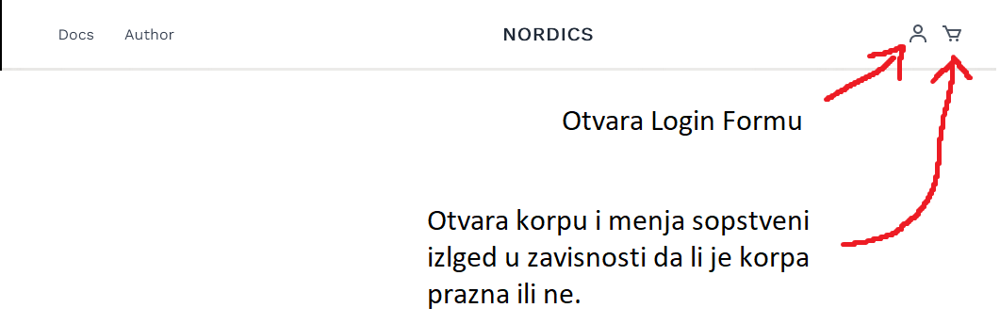
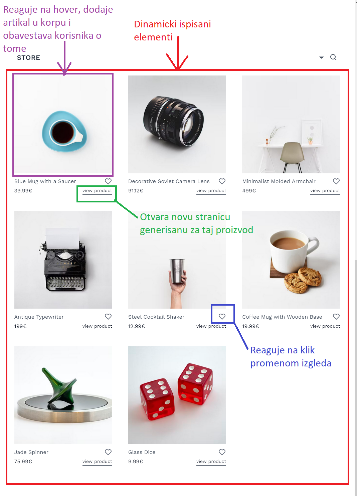
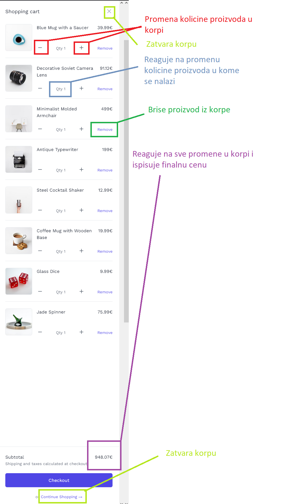
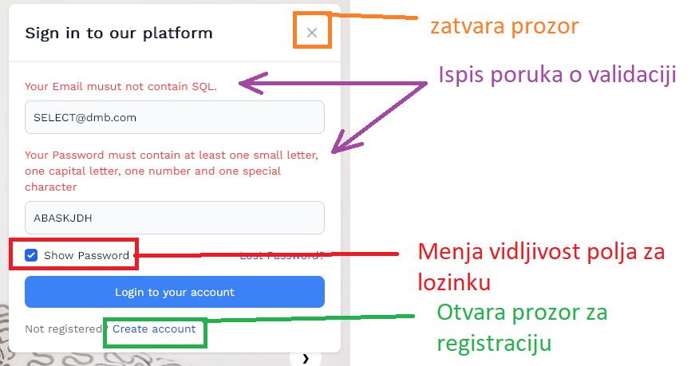

### Sadrzaj

- 


## Uvod

### Korisceni programski jesici:

- HTML
- CSS
    - TailwindCSS
- Javascript
    - JQuery
- npm
- git
    - GitHub
- Visual Studio Code
 

 ### Opis Funkcionalnosti

Dinamicko iscrtavanje prodavnice prema unapred dobijenim podacima.
U prodavnici svaki artikal ima 3 funkcionalnosti:
1. Klikom na sliku prozvoda isti se dinamicki dodaje u korpu a korisnik biva obavesten o tome
2. Klikom na srce se dinamicki menja njegov izgled (kao da je lajkovano)
3. Klikom na view product otvara se nova stranica koja se dinamicki kreira za tacno taj proizvod

Klikom na ikonice za login i korpu se pokrecu tranzicije koje otvaraju te delove sajta korisniku
Validacija formi.


### Template

Korisceni su sledeci templejti i komponente, samo html sa tailwind-om:
- [Nordic Store](https://github.com/tailwindtoolbox/Nordic-Store)
- [TailwindUI shopping cart, prvi po redu](https://tailwindui.com/components/ecommerce/components/shopping-carts)
- [Default Login Page by Flowbite](https://flowbite.com/blocks/marketing/login/#default-login-page)

#### Nordic Store

Originalni kod, koriscen u celini i celosti.
Neke od najvaznijih izmena su:
- izvucena vecina slika sa unslplash i prebacena u lokalne foldere
- promenjen nacin koriscenja tailwind-a sa cdn-a na lokalni node modul
- izvucen custom css iz style taga i integrisan u tailwind
- na liniji 17 mog javascripta u fajlu index.js se nalazi funkcija koja dinamicki stampa artikle u prodavnici
- Zamenjeni lorem ipsum tekstovi 

[Link na sledeci templejt](#shopping-cart)

```html
<!DOCTYPE html>
<html lang="en">

<head>
    <meta charset="UTF-8">
    <meta name="viewport" content="width=device-width, initial-scale=1.0">
    <meta http-equiv="X-UA-Compatible" content="ie=edge">
    <title>Tailwind Starter Template - Nordic Shop: Tailwind Toolbox</title>
    <meta name="description" content="Free open source Tailwind CSS Store template">
    <meta name="keywords" content="tailwind,tailwindcss,tailwind css,css,starter template,free template,store template, shop layout, minimal, monochrome, minimalistic, theme, nordic">
    
    <link rel="stylesheet" href="https://unpkg.com/tailwindcss@2.2.19/dist/tailwind.min.css"/>
	
    <link href="https://fonts.googleapis.com/css?family=Work+Sans:200,400&display=swap" rel="stylesheet">

    <style>
        .work-sans {
            font-family: 'Work Sans', sans-serif;
        }
                
        #menu-toggle:checked + #menu {
            display: block;
        }
        
        .hover\:grow {
            transition: all 0.3s;
            transform: scale(1);
        }
        
        .hover\:grow:hover {
            transform: scale(1.02);
        }
        
        .carousel-open:checked + .carousel-item {
            position: static;
            opacity: 100;
        }
        
        .carousel-item {
            -webkit-transition: opacity 0.6s ease-out;
            transition: opacity 0.6s ease-out;
        }
        
        #carousel-1:checked ~ .control-1,
        #carousel-2:checked ~ .control-2,
        #carousel-3:checked ~ .control-3 {
            display: block;
        }
        
        .carousel-indicators {
            list-style: none;
            margin: 0;
            padding: 0;
            position: absolute;
            bottom: 2%;
            left: 0;
            right: 0;
            text-align: center;
            z-index: 10;
        }
        
        #carousel-1:checked ~ .control-1 ~ .carousel-indicators li:nth-child(1) .carousel-bullet,
        #carousel-2:checked ~ .control-2 ~ .carousel-indicators li:nth-child(2) .carousel-bullet,
        #carousel-3:checked ~ .control-3 ~ .carousel-indicators li:nth-child(3) .carousel-bullet {
            color: #000;
            /*Set to match the Tailwind colour you want the active one to be */
        }
    </style>

</head>

<body class="bg-white text-gray-600 work-sans leading-normal text-base tracking-normal">

    <!--Nav-->
    <nav id="header" class="w-full z-30 top-0 py-1">
        <div class="w-full container mx-auto flex flex-wrap items-center justify-between mt-0 px-6 py-3">

            <label for="menu-toggle" class="cursor-pointer md:hidden block">
                <svg class="fill-current text-gray-900" xmlns="http://www.w3.org/2000/svg" width="20" height="20" viewBox="0 0 20 20">
                    <title>menu</title>
                    <path d="M0 3h20v2H0V3zm0 6h20v2H0V9zm0 6h20v2H0v-2z"></path>
                </svg>
            </label>
            <input class="hidden" type="checkbox" id="menu-toggle" />

            <div class="hidden md:flex md:items-center md:w-auto w-full order-3 md:order-1" id="menu">
                <nav>
                    <ul class="md:flex items-center justify-between text-base text-gray-700 pt-4 md:pt-0">
                        <li><a class="inline-block no-underline hover:text-black hover:underline py-2 px-4" href="#">Shop</a></li>
                        <li><a class="inline-block no-underline hover:text-black hover:underline py-2 px-4" href="#">About</a></li>
                    </ul>
                </nav>
            </div>

            <div class="order-1 md:order-2">
                <a class="flex items-center tracking-wide no-underline hover:no-underline font-bold text-gray-800 text-xl " href="#">
                    <svg class="fill-current text-gray-800 mr-2" xmlns="http://www.w3.org/2000/svg" width="24" height="24" viewBox="0 0 24 24">
                        <path d="M5,22h14c1.103,0,2-0.897,2-2V9c0-0.553-0.447-1-1-1h-3V7c0-2.757-2.243-5-5-5S7,4.243,7,7v1H4C3.447,8,3,8.447,3,9v11 C3,21.103,3.897,22,5,22z M9,7c0-1.654,1.346-3,3-3s3,1.346,3,3v1H9V7z M5,10h2v2h2v-2h6v2h2v-2h2l0.002,10H5V10z" />
                    </svg>
                    NORDICS
                </a>
            </div>

            <div class="order-2 md:order-3 flex items-center" id="nav-content">

                <a class="inline-block no-underline hover:text-black" href="#">
                    <svg class="fill-current hover:text-black" xmlns="http://www.w3.org/2000/svg" width="24" height="24" viewBox="0 0 24 24">
                        <circle fill="none" cx="12" cy="7" r="3" />
                        <path d="M12 2C9.243 2 7 4.243 7 7s2.243 5 5 5 5-2.243 5-5S14.757 2 12 2zM12 10c-1.654 0-3-1.346-3-3s1.346-3 3-3 3 1.346 3 3S13.654 10 12 10zM21 21v-1c0-3.859-3.141-7-7-7h-4c-3.86 0-7 3.141-7 7v1h2v-1c0-2.757 2.243-5 5-5h4c2.757 0 5 2.243 5 5v1H21z" />
                    </svg>
                </a>

                <a class="pl-3 inline-block no-underline hover:text-black" href="#">
                    <svg class="fill-current hover:text-black" xmlns="http://www.w3.org/2000/svg" width="24" height="24" viewBox="0 0 24 24">
                        <path d="M21,7H7.462L5.91,3.586C5.748,3.229,5.392,3,5,3H2v2h2.356L9.09,15.414C9.252,15.771,9.608,16,10,16h8 c0.4,0,0.762-0.238,0.919-0.606l3-7c0.133-0.309,0.101-0.663-0.084-0.944C21.649,7.169,21.336,7,21,7z M17.341,14h-6.697L8.371,9 h11.112L17.341,14z" />
                        <circle cx="10.5" cy="18.5" r="1.5" />
                        <circle cx="17.5" cy="18.5" r="1.5" />
                    </svg>
                </a>

            </div>
        </div>
    </nav>

    <div class="carousel relative container mx-auto" style="max-width:1600px;">
        <div class="carousel-inner relative overflow-hidden w-full">
            <!--Slide 1-->
            <input class="carousel-open" type="radio" id="carousel-1" name="carousel" aria-hidden="true" hidden="" checked="checked">
            <div class="carousel-item absolute opacity-0" style="height:50vh;">
                <div class="block h-full w-full mx-auto flex pt-6 md:pt-0 md:items-center bg-cover bg-right" style="background-image: url('https://images.unsplash.com/photo-1422190441165-ec2956dc9ecc?ixlib=rb-1.2.1&ixid=eyJhcHBfaWQiOjEyMDd9&auto=format&fit=crop&w=1600&q=80');">

                    <div class="container mx-auto">
                        <div class="flex flex-col w-full lg:w-1/2 md:ml-16 items-center md:items-start px-6 tracking-wide">
                            <p class="text-black text-2xl my-4">Stripy Zig Zag Jigsaw Pillow and Duvet Set</p>
                            <a class="text-xl inline-block no-underline border-b border-gray-600 leading-relaxed hover:text-black hover:border-black" href="#">view product</a>
                        </div>
                    </div>

                </div>
            </div>
            <label for="carousel-3" class="prev control-1 w-10 h-10 ml-2 md:ml-10 absolute cursor-pointer hidden text-3xl font-bold text-black hover:text-white rounded-full bg-white hover:bg-gray-900 leading-tight text-center z-10 inset-y-0 left-0 my-auto">‹</label>
            <label for="carousel-2" class="next control-1 w-10 h-10 mr-2 md:mr-10 absolute cursor-pointer hidden text-3xl font-bold text-black hover:text-white rounded-full bg-white hover:bg-gray-900 leading-tight text-center z-10 inset-y-0 right-0 my-auto">›</label>

            <!--Slide 2-->
            <input class="carousel-open" type="radio" id="carousel-2" name="carousel" aria-hidden="true" hidden="">
            <div class="carousel-item absolute opacity-0 bg-cover bg-right" style="height:50vh;">
                <div class="block h-full w-full mx-auto flex pt-6 md:pt-0 md:items-center bg-cover bg-right" style="background-image: url('https://images.unsplash.com/photo-1533090161767-e6ffed986c88?ixlib=rb-1.2.1&ixid=eyJhcHBfaWQiOjM0MTM2fQ&auto=format&fit=crop&w=1600&q=80');">

                    <div class="container mx-auto">
                        <div class="flex flex-col w-full lg:w-1/2 md:ml-16 items-center md:items-start px-6 tracking-wide">
                            <p class="text-black text-2xl my-4">Real Bamboo Wall Clock</p>
                            <a class="text-xl inline-block no-underline border-b border-gray-600 leading-relaxed hover:text-black hover:border-black" href="#">view product</a>
                        </div>
                    </div>

                </div>
            </div>
            <label for="carousel-1" class="prev control-2 w-10 h-10 ml-2 md:ml-10 absolute cursor-pointer hidden text-3xl font-bold text-black hover:text-white rounded-full bg-white hover:bg-gray-900  leading-tight text-center z-10 inset-y-0 left-0 my-auto">‹</label>
            <label for="carousel-3" class="next control-2 w-10 h-10 mr-2 md:mr-10 absolute cursor-pointer hidden text-3xl font-bold text-black hover:text-white rounded-full bg-white hover:bg-gray-900  leading-tight text-center z-10 inset-y-0 right-0 my-auto">›</label>

            <!--Slide 3-->
            <input class="carousel-open" type="radio" id="carousel-3" name="carousel" aria-hidden="true" hidden="">
            <div class="carousel-item absolute opacity-0" style="height:50vh;">
                <div class="block h-full w-full mx-auto flex pt-6 md:pt-0 md:items-center bg-cover bg-bottom" style="background-image: url('https://images.unsplash.com/photo-1519327232521-1ea2c736d34d?ixlib=rb-1.2.1&ixid=eyJhcHBfaWQiOjEyMDd9&auto=format&fit=crop&w=1600&q=80');">

                    <div class="container mx-auto">
                        <div class="flex flex-col w-full lg:w-1/2 md:ml-16 items-center md:items-start px-6 tracking-wide">
                            <p class="text-black text-2xl my-4">Brown and blue hardbound book</p>
                            <a class="text-xl inline-block no-underline border-b border-gray-600 leading-relaxed hover:text-black hover:border-black" href="#">view product</a>
                        </div>
                    </div>

                </div>
            </div>
            <label for="carousel-2" class="prev control-3 w-10 h-10 ml-2 md:ml-10 absolute cursor-pointer hidden text-3xl font-bold text-black hover:text-white rounded-full bg-white hover:bg-gray-900  leading-tight text-center z-10 inset-y-0 left-0 my-auto">‹</label>
            <label for="carousel-1" class="next control-3 w-10 h-10 mr-2 md:mr-10 absolute cursor-pointer hidden text-3xl font-bold text-black hover:text-white rounded-full bg-white hover:bg-gray-900  leading-tight text-center z-10 inset-y-0 right-0 my-auto">›</label>

            <!-- Add additional indicators for each slide-->
            <ol class="carousel-indicators">
                <li class="inline-block mr-3">
                    <label for="carousel-1" class="carousel-bullet cursor-pointer block text-4xl text-gray-400 hover:text-gray-900">•</label>
                </li>
                <li class="inline-block mr-3">
                    <label for="carousel-2" class="carousel-bullet cursor-pointer block text-4xl text-gray-400 hover:text-gray-900">•</label>
                </li>
                <li class="inline-block mr-3">
                    <label for="carousel-3" class="carousel-bullet cursor-pointer block text-4xl text-gray-400 hover:text-gray-900">•</label>
                </li>
            </ol>

        </div>
    </div>

    <!--	 

Alternatively if you want to just have a single hero

<section class="w-full mx-auto bg-nordic-gray-light flex pt-12 md:pt-0 md:items-center bg-cover bg-right" style="max-width:1600px; height: 32rem; background-image: url('https://images.unsplash.com/photo-1422190441165-ec2956dc9ecc?ixlib=rb-1.2.1&ixid=eyJhcHBfaWQiOjEyMDd9&auto=format&fit=crop&w=1600&q=80');">

	<div class="container mx-auto">

		<div class="flex flex-col w-full lg:w-1/2 justify-center items-start  px-6 tracking-wide">
			<h1 class="text-black text-2xl my-4">Stripy Zig Zag Jigsaw Pillow and Duvet Set</h1>
			<a class="text-xl inline-block no-underline border-b border-gray-600 leading-relaxed hover:text-black hover:border-black" href="#">products</a>

		</div>

	  </div>

</section>

-->

    <section class="bg-white py-8">

        <div class="container mx-auto flex items-center flex-wrap pt-4 pb-12">

            <nav id="store" class="w-full z-30 top-0 px-6 py-1">
                <div class="w-full container mx-auto flex flex-wrap items-center justify-between mt-0 px-2 py-3">

                    <a class="uppercase tracking-wide no-underline hover:no-underline font-bold text-gray-800 text-xl " href="#">
				Store
			</a>

                    <div class="flex items-center" id="store-nav-content">

                        <a class="pl-3 inline-block no-underline hover:text-black" href="#">
                            <svg class="fill-current hover:text-black" xmlns="http://www.w3.org/2000/svg" width="24" height="24" viewBox="0 0 24 24">
                                <path d="M7 11H17V13H7zM4 7H20V9H4zM10 15H14V17H10z" />
                            </svg>
                        </a>

                        <a class="pl-3 inline-block no-underline hover:text-black" href="#">
                            <svg class="fill-current hover:text-black" xmlns="http://www.w3.org/2000/svg" width="24" height="24" viewBox="0 0 24 24">
                                <path d="M10,18c1.846,0,3.543-0.635,4.897-1.688l4.396,4.396l1.414-1.414l-4.396-4.396C17.365,13.543,18,11.846,18,10 c0-4.411-3.589-8-8-8s-8,3.589-8,8S5.589,18,10,18z M10,4c3.309,0,6,2.691,6,6s-2.691,6-6,6s-6-2.691-6-6S6.691,4,10,4z" />
                            </svg>
                        </a>

                    </div>
              </div>
            </nav>

            <div class="w-full md:w-1/3 xl:w-1/4 p-6 flex flex-col">
                <a href="#">
                    
                    <div class="pt-3 flex items-center justify-between">
                        <p class="">Product Name</p>
                        <svg class="h-6 w-6 fill-current text-gray-500 hover:text-black" xmlns="http://www.w3.org/2000/svg" viewBox="0 0 24 24">
                            <path d="M12,4.595c-1.104-1.006-2.512-1.558-3.996-1.558c-1.578,0-3.072,0.623-4.213,1.758c-2.353,2.363-2.352,6.059,0.002,8.412 l7.332,7.332c0.17,0.299,0.498,0.492,0.875,0.492c0.322,0,0.609-0.163,0.792-0.409l7.415-7.415 c2.354-2.354,2.354-6.049-0.002-8.416c-1.137-1.131-2.631-1.754-4.209-1.754C14.513,3.037,13.104,3.589,12,4.595z M18.791,6.205 c1.563,1.571,1.564,4.025,0.002,5.588L12,18.586l-6.793-6.793C3.645,10.23,3.646,7.776,5.205,6.209 c0.76-0.756,1.754-1.172,2.799-1.172s2.035,0.416,2.789,1.17l0.5,0.5c0.391,0.391,1.023,0.391,1.414,0l0.5-0.5 C14.719,4.698,17.281,4.702,18.791,6.205z" />
                        </svg>
                    </div>
                    <p class="pt-1 text-gray-900">£9.99</p>
                </a>
            </div>

            <div class="w-full md:w-1/3 xl:w-1/4 p-6 flex flex-col">
                <a href="#">
                    
                    <div class="pt-3 flex items-center justify-between">
                        <p class="">Product Name</p>
                        <svg class="h-6 w-6 fill-current text-gray-500 hover:text-black" xmlns="http://www.w3.org/2000/svg" viewBox="0 0 24 24">
                            <path d="M12,4.595c-1.104-1.006-2.512-1.558-3.996-1.558c-1.578,0-3.072,0.623-4.213,1.758c-2.353,2.363-2.352,6.059,0.002,8.412 l7.332,7.332c0.17,0.299,0.498,0.492,0.875,0.492c0.322,0,0.609-0.163,0.792-0.409l7.415-7.415 c2.354-2.354,2.354-6.049-0.002-8.416c-1.137-1.131-2.631-1.754-4.209-1.754C14.513,3.037,13.104,3.589,12,4.595z M18.791,6.205 c1.563,1.571,1.564,4.025,0.002,5.588L12,18.586l-6.793-6.793C3.645,10.23,3.646,7.776,5.205,6.209 c0.76-0.756,1.754-1.172,2.799-1.172s2.035,0.416,2.789,1.17l0.5,0.5c0.391,0.391,1.023,0.391,1.414,0l0.5-0.5 C14.719,4.698,17.281,4.702,18.791,6.205z" />
                        </svg>
                    </div>
                    <p class="pt-1 text-gray-900">£9.99</p>
                </a>
            </div>

            <div class="w-full md:w-1/3 xl:w-1/4 p-6 flex flex-col">
                <a href="#">
                    
                    <div class="pt-3 flex items-center justify-between">
                        <p class="">Product Name</p>
                        <svg class="h-6 w-6 fill-current text-gray-500 hover:text-black" xmlns="http://www.w3.org/2000/svg" viewBox="0 0 24 24">
                            <path d="M12,4.595c-1.104-1.006-2.512-1.558-3.996-1.558c-1.578,0-3.072,0.623-4.213,1.758c-2.353,2.363-2.352,6.059,0.002,8.412 l7.332,7.332c0.17,0.299,0.498,0.492,0.875,0.492c0.322,0,0.609-0.163,0.792-0.409l7.415-7.415 c2.354-2.354,2.354-6.049-0.002-8.416c-1.137-1.131-2.631-1.754-4.209-1.754C14.513,3.037,13.104,3.589,12,4.595z M18.791,6.205 c1.563,1.571,1.564,4.025,0.002,5.588L12,18.586l-6.793-6.793C3.645,10.23,3.646,7.776,5.205,6.209 c0.76-0.756,1.754-1.172,2.799-1.172s2.035,0.416,2.789,1.17l0.5,0.5c0.391,0.391,1.023,0.391,1.414,0l0.5-0.5 C14.719,4.698,17.281,4.702,18.791,6.205z" />
                        </svg>
                    </div>
                    <p class="pt-1 text-gray-900">£9.99</p>
                </a>
            </div>

            <div class="w-full md:w-1/3 xl:w-1/4 p-6 flex flex-col">
                <a href="#">
                    
                    <div class="pt-3 flex items-center justify-between">
                        <p class="">Product Name</p>
                        <svg class="h-6 w-6 fill-current text-gray-500 hover:text-black" xmlns="http://www.w3.org/2000/svg" viewBox="0 0 24 24">
                            <path d="M12,4.595c-1.104-1.006-2.512-1.558-3.996-1.558c-1.578,0-3.072,0.623-4.213,1.758c-2.353,2.363-2.352,6.059,0.002,8.412 l7.332,7.332c0.17,0.299,0.498,0.492,0.875,0.492c0.322,0,0.609-0.163,0.792-0.409l7.415-7.415 c2.354-2.354,2.354-6.049-0.002-8.416c-1.137-1.131-2.631-1.754-4.209-1.754C14.513,3.037,13.104,3.589,12,4.595z M18.791,6.205 c1.563,1.571,1.564,4.025,0.002,5.588L12,18.586l-6.793-6.793C3.645,10.23,3.646,7.776,5.205,6.209 c0.76-0.756,1.754-1.172,2.799-1.172s2.035,0.416,2.789,1.17l0.5,0.5c0.391,0.391,1.023,0.391,1.414,0l0.5-0.5 C14.719,4.698,17.281,4.702,18.791,6.205z" />
                        </svg>
                    </div>
                    <p class="pt-1 text-gray-900">£9.99</p>
                </a>
            </div>

            <div class="w-full md:w-1/3 xl:w-1/4 p-6 flex flex-col">
                <a href="#">
                    
                    <div class="pt-3 flex items-center justify-between">
                        <p class="">Product Name</p>
                        <svg class="h-6 w-6 fill-current text-gray-500 hover:text-black" xmlns="http://www.w3.org/2000/svg" viewBox="0 0 24 24">
                            <path d="M12,4.595c-1.104-1.006-2.512-1.558-3.996-1.558c-1.578,0-3.072,0.623-4.213,1.758c-2.353,2.363-2.352,6.059,0.002,8.412 l7.332,7.332c0.17,0.299,0.498,0.492,0.875,0.492c0.322,0,0.609-0.163,0.792-0.409l7.415-7.415 c2.354-2.354,2.354-6.049-0.002-8.416c-1.137-1.131-2.631-1.754-4.209-1.754C14.513,3.037,13.104,3.589,12,4.595z M18.791,6.205 c1.563,1.571,1.564,4.025,0.002,5.588L12,18.586l-6.793-6.793C3.645,10.23,3.646,7.776,5.205,6.209 c0.76-0.756,1.754-1.172,2.799-1.172s2.035,0.416,2.789,1.17l0.5,0.5c0.391,0.391,1.023,0.391,1.414,0l0.5-0.5 C14.719,4.698,17.281,4.702,18.791,6.205z" />
                        </svg>
                    </div>
                    <p class="pt-1 text-gray-900">£9.99</p>
                </a>
            </div>

            <div class="w-full md:w-1/3 xl:w-1/4 p-6 flex flex-col">
                <a href="#">
                    
                    <div class="pt-3 flex items-center justify-between">
                        <p class="">Product Name</p>
                        <svg class="h-6 w-6 fill-current text-gray-500 hover:text-black" xmlns="http://www.w3.org/2000/svg" viewBox="0 0 24 24">
                            <path d="M12,4.595c-1.104-1.006-2.512-1.558-3.996-1.558c-1.578,0-3.072,0.623-4.213,1.758c-2.353,2.363-2.352,6.059,0.002,8.412 l7.332,7.332c0.17,0.299,0.498,0.492,0.875,0.492c0.322,0,0.609-0.163,0.792-0.409l7.415-7.415 c2.354-2.354,2.354-6.049-0.002-8.416c-1.137-1.131-2.631-1.754-4.209-1.754C14.513,3.037,13.104,3.589,12,4.595z M18.791,6.205 c1.563,1.571,1.564,4.025,0.002,5.588L12,18.586l-6.793-6.793C3.645,10.23,3.646,7.776,5.205,6.209 c0.76-0.756,1.754-1.172,2.799-1.172s2.035,0.416,2.789,1.17l0.5,0.5c0.391,0.391,1.023,0.391,1.414,0l0.5-0.5 C14.719,4.698,17.281,4.702,18.791,6.205z" />
                        </svg>
                    </div>
                    <p class="pt-1 text-gray-900">£9.99</p>
                </a>
            </div>

            <div class="w-full md:w-1/3 xl:w-1/4 p-6 flex flex-col">
                <a href="#">
                    
                    <div class="pt-3 flex items-center justify-between">
                        <p class="">Product Name</p>
                        <svg class="h-6 w-6 fill-current text-gray-500 hover:text-black" xmlns="http://www.w3.org/2000/svg" viewBox="0 0 24 24">
                            <path d="M12,4.595c-1.104-1.006-2.512-1.558-3.996-1.558c-1.578,0-3.072,0.623-4.213,1.758c-2.353,2.363-2.352,6.059,0.002,8.412 l7.332,7.332c0.17,0.299,0.498,0.492,0.875,0.492c0.322,0,0.609-0.163,0.792-0.409l7.415-7.415 c2.354-2.354,2.354-6.049-0.002-8.416c-1.137-1.131-2.631-1.754-4.209-1.754C14.513,3.037,13.104,3.589,12,4.595z M18.791,6.205 c1.563,1.571,1.564,4.025,0.002,5.588L12,18.586l-6.793-6.793C3.645,10.23,3.646,7.776,5.205,6.209 c0.76-0.756,1.754-1.172,2.799-1.172s2.035,0.416,2.789,1.17l0.5,0.5c0.391,0.391,1.023,0.391,1.414,0l0.5-0.5 C14.719,4.698,17.281,4.702,18.791,6.205z" />
                        </svg>
                    </div>
                    <p class="pt-1 text-gray-900">£9.99</p>
                </a>
            </div>

            <div class="w-full md:w-1/3 xl:w-1/4 p-6 flex flex-col">
                <a href="#">
                    
                    <div class="pt-3 flex items-center justify-between">
                        <p class="">Product Name</p>
                        <svg class="h-6 w-6 fill-current text-gray-500 hover:text-black" xmlns="http://www.w3.org/2000/svg" viewBox="0 0 24 24">
                            <path d="M12,4.595c-1.104-1.006-2.512-1.558-3.996-1.558c-1.578,0-3.072,0.623-4.213,1.758c-2.353,2.363-2.352,6.059,0.002,8.412 l7.332,7.332c0.17,0.299,0.498,0.492,0.875,0.492c0.322,0,0.609-0.163,0.792-0.409l7.415-7.415 c2.354-2.354,2.354-6.049-0.002-8.416c-1.137-1.131-2.631-1.754-4.209-1.754C14.513,3.037,13.104,3.589,12,4.595z M18.791,6.205 c1.563,1.571,1.564,4.025,0.002,5.588L12,18.586l-6.793-6.793C3.645,10.23,3.646,7.776,5.205,6.209 c0.76-0.756,1.754-1.172,2.799-1.172s2.035,0.416,2.789,1.17l0.5,0.5c0.391,0.391,1.023,0.391,1.414,0l0.5-0.5 C14.719,4.698,17.281,4.702,18.791,6.205z" />
                        </svg>
                    </div>
                    <p class="pt-1 text-gray-900">£9.99</p>
                </a>
            </div>

            </div>

    </section>

    <section class="bg-white py-8">

        <div class="container py-8 px-6 mx-auto">

            <a class="uppercase tracking-wide no-underline hover:no-underline font-bold text-gray-800 text-xl mb-8" href="#">
			About
		</a>

            <p class="mt-8 mb-8">This template is inspired by the stunning nordic minimalist design - in particular:
                <br>
                <a class="text-gray-800 underline hover:text-gray-900" href="http://savoy.nordicmade.com/" target="_blank">Savoy Theme</a> created by <a class="text-gray-800 underline hover:text-gray-900" href="https://nordicmade.com/">https://nordicmade.com/</a> and <a class="text-gray-800 underline hover:text-gray-900" href="https://www.metricdesign.no/" target="_blank">https://www.metricdesign.no/</a></p>

            <p class="mb-8">Lorem ipsum dolor sit amet, consectetur <a href="#">random link</a> adipiscing elit, sed do eiusmod tempor incididunt ut labore et dolore magna aliqua. Vel risus commodo viverra maecenas accumsan lacus vel facilisis volutpat. Vitae aliquet nec ullamcorper sit. Nullam eget felis eget nunc lobortis mattis aliquam. In est ante in nibh mauris. Egestas congue quisque egestas diam in. Facilisi nullam vehicula ipsum a arcu. Nec nam aliquam sem et tortor consequat. Eget mi proin sed libero enim sed faucibus turpis in. Hac habitasse platea dictumst quisque. In aliquam sem fringilla ut. Gravida rutrum quisque non tellus orci ac auctor augue mauris. Accumsan lacus vel facilisis volutpat est velit egestas dui id. At tempor commodo ullamcorper a. Volutpat commodo sed egestas egestas fringilla. Vitae congue eu consequat ac.</p>

        </div>

    </section>

<footer class="container mx-auto bg-white py-8 border-t border-gray-400">
  <div class="container flex px-3 py-8 ">
    <div class="w-full mx-auto flex flex-wrap">
      <div class="flex w-full lg:w-1/2 ">
        <div class="px-3 md:px-0">
          <h3 class="font-bold text-gray-900">About</h3>
          <p class="py-4">
            Lorem ipsum dolor sit amet, consectetur adipiscing elit. Maecenas vel mi ut felis tempus commodo nec id erat. Suspendisse consectetur dapibus velit ut lacinia.
          </p>
        </div>
      </div>
      <div class="flex w-full lg:w-1/2 lg:justify-end lg:text-right mt-6 md:mt-0">
        <div class="px-3 md:px-0">
          <h3 class="text-left font-bold text-gray-900">Social</h3>

          <div class="w-full flex items-center py-4 mt-0">
            <a href="#" class="mx-2">
              <svg class="w-6 h-6 fill-current" viewBox="0 0 24 24">
                <path d="M23.953 4.57a10 10 0 01-2.825.775 4.958 4.958 0 002.163-2.723c-.951.555-2.005.959-3.127 1.184a4.92 4.92 0 00-8.384 4.482C7.69 8.095 4.067 6.13 1.64 3.162a4.822 4.822 0 00-.666 2.475c0 1.71.87 3.213 2.188 4.096a4.904 4.904 0 01-2.228-.616v.06a4.923 4.923 0 003.946 4.827 4.996 4.996 0 01-2.212.085 4.936 4.936 0 004.604 3.417 9.867 9.867 0 01-6.102 2.105c-.39 0-.779-.023-1.17-.067a13.995 13.995 0 007.557 2.209c9.053 0 13.998-7.496 13.998-13.985 0-.21 0-.42-.015-.63A9.935 9.935 0 0024 4.59z"></path>
              </svg>
            </a>
            <a href="#" class="mx-2">
              <svg class="w-6 h-6 fill-current" viewBox="0 0 24 24">
                <path d="M24 12.073c0-6.627-5.373-12-12-12s-12 5.373-12 12c0 5.99 4.388 10.954 10.125 11.854v-8.385H7.078v-3.47h3.047V9.43c0-3.007 1.792-4.669 4.533-4.669 1.312 0 2.686.235 2.686.235v2.953H15.83c-1.491 0-1.956.925-1.956 1.874v2.25h3.328l-.532 3.47h-2.796v8.385C19.612 23.027 24 18.062 24 12.073z"></path>
              </svg>
            </a>
            <a href="#" class="mx-2">
              <svg class="w-6 h-6 fill-current" viewBox="0 0 24 24">
                <path d="M12 0C8.74 0 8.333.015 7.053.072 5.775.132 4.905.333 4.14.63c-.789.306-1.459.717-2.126 1.384S.935 3.35.63 4.14C.333 4.905.131 5.775.072 7.053.012 8.333 0 8.74 0 12s.015 3.667.072 4.947c.06 1.277.261 2.148.558 2.913.306.788.717 1.459 1.384 2.126.667.666 1.336 1.079 2.126 1.384.766.296 1.636.499 2.913.558C8.333 23.988 8.74 24 12 24s3.667-.015 4.947-.072c1.277-.06 2.148-.262 2.913-.558.788-.306 1.459-.718 2.126-1.384.666-.667 1.079-1.335 1.384-2.126.296-.765.499-1.636.558-2.913.06-1.28.072-1.687.072-4.947s-.015-3.667-.072-4.947c-.06-1.277-.262-2.149-.558-2.913-.306-.789-.718-1.459-1.384-2.126C21.319 1.347 20.651.935 19.86.63c-.765-.297-1.636-.499-2.913-.558C15.667.012 15.26 0 12 0zm0 2.16c3.203 0 3.585.016 4.85.071 1.17.055 1.805.249 2.227.415.562.217.96.477 1.382.896.419.42.679.819.896 1.381.164.422.36 1.057.413 2.227.057 1.266.07 1.646.07 4.85s-.015 3.585-.074 4.85c-.061 1.17-.256 1.805-.421 2.227-.224.562-.479.96-.899 1.382-.419.419-.824.679-1.38.896-.42.164-1.065.36-2.235.413-1.274.057-1.649.07-4.859.07-3.211 0-3.586-.015-4.859-.074-1.171-.061-1.816-.256-2.236-.421-.569-.224-.96-.479-1.379-.899-.421-.419-.69-.824-.9-1.38-.165-.42-.359-1.065-.42-2.235-.045-1.26-.061-1.649-.061-4.844 0-3.196.016-3.586.061-4.861.061-1.17.255-1.814.42-2.234.21-.57.479-.96.9-1.381.419-.419.81-.689 1.379-.898.42-.166 1.051-.361 2.221-.421 1.275-.045 1.65-.06 4.859-.06l.045.03zm0 3.678c-3.405 0-6.162 2.76-6.162 6.162 0 3.405 2.76 6.162 6.162 6.162 3.405 0 6.162-2.76 6.162-6.162 0-3.405-2.76-6.162-6.162-6.162zM12 16c-2.21 0-4-1.79-4-4s1.79-4 4-4 4 1.79 4 4-1.79 4-4 4zm7.846-10.405c0 .795-.646 1.44-1.44 1.44-.795 0-1.44-.646-1.44-1.44 0-.794.646-1.439 1.44-1.439.793-.001 1.44.645 1.44 1.439z"></path>
              </svg>
            </a>
            <a href="#" class="mx-2">
              <svg class="w-6 h-6 fill-current" viewBox="0 0 24 24">
                <path d="M12.017 0C5.396 0 .029 5.367.029 11.987c0 5.079 3.158 9.417 7.618 11.162-.105-.949-.199-2.403.041-3.439.219-.937 1.406-5.957 1.406-5.957s-.359-.72-.359-1.781c0-1.663.967-2.911 2.168-2.911 1.024 0 1.518.769 1.518 1.688 0 1.029-.653 2.567-.992 3.992-.285 1.193.6 2.165 1.775 2.165 2.128 0 3.768-2.245 3.768-5.487 0-2.861-2.063-4.869-5.008-4.869-3.41 0-5.409 2.562-5.409 5.199 0 1.033.394 2.143.889 2.741.099.12.112.225.085.345-.09.375-.293 1.199-.334 1.363-.053.225-.172.271-.401.165-1.495-.69-2.433-2.878-2.433-4.646 0-3.776 2.748-7.252 7.92-7.252 4.158 0 7.392 2.967 7.392 6.923 0 4.135-2.607 7.462-6.233 7.462-1.214 0-2.354-.629-2.758-1.379l-.749 2.848c-.269 1.045-1.004 2.352-1.498 3.146 1.123.345 2.306.535 3.55.535 6.607 0 11.985-5.365 11.985-11.987C23.97 5.39 18.592.026 11.985.026L12.017 0z"></path>
              </svg>
            </a>
          </div>
        </div>
      </div>
    </div>
  </div>
</footer>

</body>

</html>
```
<a id="shopping-cart"></a>
[Pocetak prethodnog templejta](#nordic-store)
### TailwindUI Shopping Cart

Koriscen u celini, izmene sledece:
- pokretanje tranzicije klikom na dugme sa ikonickom potrosacke korpe
- dinamicko dodavanje odgovarajucih artikala u korpu
- menjanje kolicine artikala u korpi
- brisanje artikala iz korpe
- korektnan proracun konacne cene

[Link na sledeci templejt](#default-login)
```html
<div class="relative z-10" aria-labelledby="slide-over-title" role="dialog" aria-modal="true">
  <!--
    Background backdrop, show/hide based on slide-over state.

    Entering: "ease-in-out duration-500"
      From: "opacity-0"
      To: "opacity-100"
    Leaving: "ease-in-out duration-500"
      From: "opacity-100"
      To: "opacity-0"
  -->
  <div class="fixed inset-0 bg-gray-500 bg-opacity-75 transition-opacity"></div>

  <div class="fixed inset-0 overflow-hidden">
    <div class="absolute inset-0 overflow-hidden">
      <div class="pointer-events-none fixed inset-y-0 right-0 flex max-w-full pl-10">
        <!--
          Slide-over panel, show/hide based on slide-over state.

          Entering: "transform transition ease-in-out duration-500 sm:duration-700"
            From: "translate-x-full"
            To: "translate-x-0"
          Leaving: "transform transition ease-in-out duration-500 sm:duration-700"
            From: "translate-x-0"
            To: "translate-x-full"
        -->
        <div class="pointer-events-auto w-screen max-w-md">
          <div class="flex h-full flex-col overflow-y-scroll bg-white shadow-xl">
            <div class="flex-1 overflow-y-auto px-4 py-6 sm:px-6">
              <div class="flex items-start justify-between">
                <h2 class="text-lg font-medium text-gray-900" id="slide-over-title">Shopping cart</h2>
                <div class="ml-3 flex h-7 items-center">
                  <button type="button" class="relative -m-2 p-2 text-gray-400 hover:text-gray-500">
                    <span class="absolute -inset-0.5"></span>
                    <span class="sr-only">Close panel</span>
                    <svg class="h-6 w-6" fill="none" viewBox="0 0 24 24" stroke-width="1.5" stroke="currentColor" aria-hidden="true">
                      <path stroke-linecap="round" stroke-linejoin="round" d="M6 18L18 6M6 6l12 12" />
                    </svg>
                  </button>
                </div>
              </div>

              <div class="mt-8">
                <div class="flow-root">
                  <ul role="list" class="-my-6 divide-y divide-gray-200">
                    <li class="flex py-6">
                      <div class="h-24 w-24 flex-shrink-0 overflow-hidden rounded-md border border-gray-200">
                        
                      </div>

                      <div class="ml-4 flex flex-1 flex-col">
                        <div>
                          <div class="flex justify-between text-base font-medium text-gray-900">
                            <h3>
                              <a href="#">Throwback Hip Bag</a>
                            </h3>
                            <p class="ml-4">$90.00</p>
                          </div>
                          <p class="mt-1 text-sm text-gray-500">Salmon</p>
                        </div>
                        <div class="flex flex-1 items-end justify-between text-sm">
                          <p class="text-gray-500">Qty 1</p>

                          <div class="flex">
                            <button type="button" class="font-medium text-indigo-600 hover:text-indigo-500">Remove</button>
                          </div>
                        </div>
                      </div>
                    </li>
                    <li class="flex py-6">
                      <div class="h-24 w-24 flex-shrink-0 overflow-hidden rounded-md border border-gray-200">
                        
                      </div>

                      <div class="ml-4 flex flex-1 flex-col">
                        <div>
                          <div class="flex justify-between text-base font-medium text-gray-900">
                            <h3>
                              <a href="#">Medium Stuff Satchel</a>
                            </h3>
                            <p class="ml-4">$32.00</p>
                          </div>
                          <p class="mt-1 text-sm text-gray-500">Blue</p>
                        </div>
                        <div class="flex flex-1 items-end justify-between text-sm">
                          <p class="text-gray-500">Qty 1</p>

                          <div class="flex">
                            <button type="button" class="font-medium text-indigo-600 hover:text-indigo-500">Remove</button>
                          </div>
                        </div>
                      </div>
                    </li>

                    <!-- More products... -->
                  </ul>
                </div>
              </div>
            </div>

            <div class="border-t border-gray-200 px-4 py-6 sm:px-6">
              <div class="flex justify-between text-base font-medium text-gray-900">
                <p>Subtotal</p>
                <p>$262.00</p>
              </div>
              <p class="mt-0.5 text-sm text-gray-500">Shipping and taxes calculated at checkout.</p>
              <div class="mt-6">
                <a href="#" class="flex items-center justify-center rounded-md border border-transparent bg-indigo-600 px-6 py-3 text-base font-medium text-white shadow-sm hover:bg-indigo-700">Checkout</a>
              </div>
              <div class="mt-6 flex justify-center text-center text-sm text-gray-500">
                <p>
                  or
                  <button type="button" class="font-medium text-indigo-600 hover:text-indigo-500">
                    Continue Shopping
                    <span aria-hidden="true"> &rarr;</span>
                  </button>
                </p>
              </div>
            </div>
          </div>
        </div>
      </div>
    </div>
  </div>
</div>

```
[Link na pocetak prethodnog templejta](#shopping-cart)

### Default Login Page by Flowbite

<a id="default-login"></a>

Koriscen u celini i od njega napravljena registraciona forma takodje

Izmene:
- izbacena tamna tema
- checkboxu za pamcenje korisnika promenjen naziv i namena (index.js linija 307)

Dodaci:
 - validacija
 - tranzicije

[Link na kraj templejt sekcije](#kraj-templejtova)

Originalni Kod:
```html
<section class="bg-gray-50 dark:bg-gray-900">
  <div class="flex flex-col items-center justify-center px-6 py-8 mx-auto md:h-screen lg:py-0">
      <a href="#" class="flex items-center mb-6 text-2xl font-semibold text-gray-900 dark:text-white">
          
          Flowbite    
      </a>
      <div class="w-full bg-white rounded-lg shadow dark:border md:mt-0 sm:max-w-md xl:p-0 dark:bg-gray-800 dark:border-gray-700">
          <div class="p-6 space-y-4 md:space-y-6 sm:p-8">
              <h1 class="text-xl font-bold leading-tight tracking-tight text-gray-900 md:text-2xl dark:text-white">
                  Sign in to your account
              </h1>
              <form class="space-y-4 md:space-y-6" action="#">
                  <div>
                      <label for="email" class="block mb-2 text-sm font-medium text-gray-900 dark:text-white">Your email</label>
                      <input type="email" name="email" id="email" class="bg-gray-50 border border-gray-300 text-gray-900 sm:text-sm rounded-lg focus:ring-primary-600 focus:border-primary-600 block w-full p-2.5 dark:bg-gray-700 dark:border-gray-600 dark:placeholder-gray-400 dark:text-white dark:focus:ring-blue-500 dark:focus:border-blue-500" placeholder="name@company.com" required="">
                  </div>
                  <div>
                      <label for="password" class="block mb-2 text-sm font-medium text-gray-900 dark:text-white">Password</label>
                      <input type="password" name="password" id="password" placeholder="••••••••" class="bg-gray-50 border border-gray-300 text-gray-900 sm:text-sm rounded-lg focus:ring-primary-600 focus:border-primary-600 block w-full p-2.5 dark:bg-gray-700 dark:border-gray-600 dark:placeholder-gray-400 dark:text-white dark:focus:ring-blue-500 dark:focus:border-blue-500" required="">
                  </div>
                  <div class="flex items-center justify-between">
                      <div class="flex items-start">
                          <div class="flex items-center h-5">
                            <input id="remember" aria-describedby="remember" type="checkbox" class="w-4 h-4 border border-gray-300 rounded bg-gray-50 focus:ring-3 focus:ring-primary-300 dark:bg-gray-700 dark:border-gray-600 dark:focus:ring-primary-600 dark:ring-offset-gray-800" required="">
                          </div>
                          <div class="ml-3 text-sm">
                            <label for="remember" class="text-gray-500 dark:text-gray-300">Remember me</label>
                          </div>
                      </div>
                      <a href="#" class="text-sm font-medium text-primary-600 hover:underline dark:text-primary-500">Forgot password?</a>
                  </div>
                  <button type="submit" class="w-full text-white bg-primary-600 hover:bg-primary-700 focus:ring-4 focus:outline-none focus:ring-primary-300 font-medium rounded-lg text-sm px-5 py-2.5 text-center dark:bg-primary-600 dark:hover:bg-primary-700 dark:focus:ring-primary-800">Sign in</button>
                  <p class="text-sm font-light text-gray-500 dark:text-gray-400">
                      Don’t have an account yet? <a href="#" class="font-medium text-primary-600 hover:underline dark:text-primary-500">Sign up</a>
                  </p>
              </form>
          </div>
      </div>
  </div>
</section>
```

<a id="kraj-templejtova"></a>

# Organizacija

### Organizaciona sema:
    _________
    |       |
    | index |
    |_______|
        |
        |
    ____|____
    |       |
    |product|
    |_______|

### Sitemap:

```xml
<?xml version="1.0" encoding="UTF-8"?>
<urlset xsi:schemaLocation="http://www.sitemaps.org/schemas/sitemap/0.9 http://www.sitemaps.org/schemas/sitemap/0.9/sitemap.xsd">
<url>
<loc>https://aleksiye.github.io/Nordic-Store/index.html</loc>
<lastmod>2023-12-10T00:52:13+00:00</lastmod>
<priority>1.00</priority>
<changefreq>always</changefreq>
</url>
<url>
<loc>https://aleksiye.github.io/Nordic-Store/product.html</loc>
<lastmod>2023-12-10T00:52:13+00:00</lastmod>
<priority>0.80</priority>
<changefreq>always</changefreq>
</url>
</urlset>
```

# Slike stranica i Opis Funkcionalnosti





 

# Kompletan kod: 
<a id="index"></a>
[sledeci fajl](#product)

### index.html

```html
<!DOCTYPE html>
<html lang="en">

<head>
    <meta charset="UTF-8">
    <meta name="viewport" content="width=device-width, initial-scale=1.0">
    <meta http-equiv="X-UA-Compatible" content="ie=edge">
    <title>Nordics Store</title>
    <meta name="description" content="Nordic Store - a place of exquisite decour">
    <meta name="keywords" content="store product decour minimalist elegant nordic">
    <link rel="shortcut icon" href="./assets/img/favicon.ico" type="image/x-icon">
    <link rel="stylesheet" href="./assets/css/output.css">
    <link href="https://fonts.googleapis.com/css?family=Work+Sans:200,400&display=swap" rel="stylesheet">

</head>
<body class="bg-white text-gray-600 work-sans leading-normal text-base tracking-normal">
    <!--Nav-->
    <nav id="header" class="w-full z-30 top-0 py-1">
        <div class="w-full container mx-auto flex flex-wrap items-center justify-between mt-0 px-6 py-3">

            <label for="menu-toggle" class="cursor-pointer md:hidden block">
                <svg class="fill-current text-gray-900" xmlns="http://www.w3.org/2000/svg" width="20" height="20" viewBox="0 0 20 20">
                    <title>menu</title>
                    <path d="M0 3h20v2H0V3zm0 6h20v2H0V9zm0 6h20v2H0v-2z"></path>
                </svg>
            </label>
            <input class="hidden" type="checkbox" id="menu-toggle" />

            <div class="hidden md:flex md:items-center md:w-auto w-full order-3 md:order-1" id="menu">
                <nav>
                    <ul class="md:flex items-center justify-between text-base text-gray-700 pt-4 md:pt-0">
                        <li><a class="inline-block no-underline hover:text-black hover:underline py-2 px-4" href="#">Docs</a></li>
                        <li><a class="inline-block no-underline hover:text-black hover:underline py-2 px-4" href="#">Author</a></li>
                    </ul>
                </nav>
            </div>

            <div class="order-1 md:order-2">
                <a class="flex items-center tracking-wide no-underline hover:no-underline font-bold text-gray-800 text-xl " href="index.html">
                    NORDICS
                </a>
            </div>

            <div class="order-2 md:order-3 flex items-center" id="nav-content">

                <button id="login-toggle" type="button" class="login-toggle inline-block no-underline hover:text-black" aria-label="Login" data-modal-target="authentication-modal" data-modal-toggle="authentication-modal">
                    <svg class="fill-current hover:text-black" xmlns="http://www.w3.org/2000/svg" width="24" height="24" viewBox="0 0 24 24">
                        <circle fill="none" cx="12" cy="7" r="3" />
                        <path d="M12 2C9.243 2 7 4.243 7 7s2.243 5 5 5 5-2.243 5-5S14.757 2 12 2zM12 10c-1.654 0-3-1.346-3-3s1.346-3 3-3 3 1.346 3 3S13.654 10 12 10zM21 21v-1c0-3.859-3.141-7-7-7h-4c-3.86 0-7 3.141-7 7v1h2v-1c0-2.757 2.243-5 5-5h4c2.757 0 5 2.243 5 5v1H21z" />
                    </svg>
                </button>

                <button id="cart-toggle" type="button" aria-label="Cart" class="cart-toggle relative ml-3 inline-block no-underline hover:text-black">
                    <svg class="fill-current hover:text-black" xmlns="http://www.w3.org/2000/svg" width="24" height="24" viewBox="0 0 24 24">
                        <path d="M21,7H7.462L5.91,3.586C5.748,3.229,5.392,3,5,3H2v2h2.356L9.09,15.414C9.252,15.771,9.608,16,10,16h8 c0.4,0,0.762-0.238,0.919-0.606l3-7c0.133-0.309,0.101-0.663-0.084-0.944C21.649,7.169,21.336,7,21,7z M17.341,14h-6.697L8.371,9 h11.112L17.341,14z" />
                        <circle cx="10.5" cy="18.5" r="1.5" />
                        <circle cx="17.5" cy="18.5" r="1.5" />
                    </svg>
                </button>

            </div>
        </div>
    </nav>

    <div class="carousel relative container mx-auto max-w-[1600px]">
        <div class="carousel-inner relative overflow-hidden w-full">
            <!--Slide 1-->
            <input class="carousel-open hidden" type="radio" id="carousel-1" name="carousel" aria-hidden="true" checked="checked">
            <div class="carousel-item absolute opacity-0 h-[50vh]">
                <div class="block h-full w-full mx-auto lg:flex pt-6 md:pt-0 md:items-center bg-cover bg-right bg-slide-one">

                    <div class="container mx-auto">
                        <div class="flex flex-col w-full lg:w-1/2 md:ml-16 items-center md:items-start px-6 tracking-wide">
                            <p class="text-black text-2xl my-4">Stripy Zig Zag Jigsaw Pillow and Duvet Set</p>
                            <a class="text-xl inline-block no-underline border-b border-gray-600 leading-relaxed hover:text-black hover:border-black" href="#">view product</a>
                        </div>
                    </div>

                </div>
            </div>
            <label for="carousel-3" class="prev control-1 w-10 h-10 ml-2 md:ml-10 absolute cursor-pointer hidden text-3xl font-bold text-black hover:text-white rounded-full bg-white hover:bg-gray-900 leading-tight text-center z-10 inset-y-0 left-0 my-auto">‹</label>
            <label for="carousel-2" class="next control-1 w-10 h-10 mr-2 md:mr-10 absolute cursor-pointer hidden text-3xl font-bold text-black hover:text-white rounded-full bg-white hover:bg-gray-900 leading-tight text-center z-10 inset-y-0 right-0 my-auto">›</label>

            <!--Slide 2-->
            <input class="carousel-open hidden" type="radio" id="carousel-2" name="carousel" aria-hidden="true">
            <div class="carousel-item absolute opacity-0 bg-cover bg-right h-[50vh]">
                <div class="block h-full w-full mx-auto lg:flex pt-6 md:pt-0 md:items-center bg-cover bg-right bg-slide-two">

                    <div class="container mx-auto">
                        <div class="flex flex-col w-full lg:w-1/2 md:ml-16 items-center md:items-start px-6 tracking-wide">
                            <p class="text-black text-2xl my-4">Real Bamboo Wall Clock</p>
                            <a class="text-xl inline-block no-underline border-b border-gray-600 leading-relaxed hover:text-black hover:border-black" href="#">view product</a>
                        </div>
                    </div>

                </div>
            </div>
            <label for="carousel-1" class="prev control-2 w-10 h-10 ml-2 md:ml-10 absolute cursor-pointer hidden text-3xl font-bold text-black hover:text-white rounded-full bg-white hover:bg-gray-900  leading-tight text-center z-10 inset-y-0 left-0 my-auto">‹</label>
            <label for="carousel-3" class="next control-2 w-10 h-10 mr-2 md:mr-10 absolute cursor-pointer hidden text-3xl font-bold text-black hover:text-white rounded-full bg-white hover:bg-gray-900  leading-tight text-center z-10 inset-y-0 right-0 my-auto">›</label>

            <!--Slide 3-->
            <input class="carousel-open hidden" type="radio" id="carousel-3" name="carousel" aria-hidden="true">
            <div class="carousel-item absolute opacity-0 h-[50vh]">
                <div class="block h-full w-full mx-auto lg:flex pt-6 md:pt-0 md:items-center bg-cover bg-bottom bg-slide-three");">

                    <div class="container mx-auto">
                        <div class="flex flex-col w-full lg:w-1/2 md:ml-16 items-center md:items-start px-6 tracking-wide">
                            <p class="text-black text-2xl my-4">Brown and blue hardbound book</p>
                            <a class="text-xl inline-block no-underline border-b border-gray-600 leading-relaxed hover:text-black hover:border-black" href="#">view product</a>
                        </div>
                    </div>

                </div>
            </div>
            <label for="carousel-2" class="prev control-3 w-10 h-10 ml-2 md:ml-10 absolute cursor-pointer hidden text-3xl font-bold text-black hover:text-white rounded-full bg-white hover:bg-gray-900  leading-tight text-center z-10 inset-y-0 left-0 my-auto">‹</label>
            <label for="carousel-1" class="next control-3 w-10 h-10 mr-2 md:mr-10 absolute cursor-pointer hidden text-3xl font-bold text-black hover:text-white rounded-full bg-white hover:bg-gray-900  leading-tight text-center z-10 inset-y-0 right-0 my-auto">›</label>

            <!-- Add additional indicators for each slide-->
            <ol class="carousel-indicators">
                <li class="inline-block mr-3">
                    <label for="carousel-1" class="carousel-bullet cursor-pointer block text-4xl text-gray-400 hover:text-gray-900">•</label>
                </li>
                <li class="inline-block mr-3">
                    <label for="carousel-2" class="carousel-bullet cursor-pointer block text-4xl text-gray-400 hover:text-gray-900">•</label>
                </li>
                <li class="inline-block mr-3">
                    <label for="carousel-3" class="carousel-bullet cursor-pointer block text-4xl text-gray-400 hover:text-gray-900">•</label>
                </li>
            </ol>

        </div>
    </div>

    <section class="bg-white py-8">

      <div class="container py-8 px-6 mx-auto">

          <a id="about" class="uppercase tracking-wide no-underline hover:no-underline font-bold text-gray-800 text-xl mb-8" href="#about">
    About
  </a>

          <p class="mt-8 mb-8">Wellcome to Nordic Store, your premier destination for Nordic inspired decour that seamlessly blends tradition with modern elegance:
              <br>
              </p>

          <p class="mb-8">At Nordic Store we believe in the power of giving back. That's why we are commited to donating 20% of every purchase to <a class="inline-block no-underline border-b border-gray-600 hover:text-black hover:border-black" href="example.com">charitable causes</a>. By choosing our unique products, you're not only bringing a touch of Nordic charm int oyoru home but also contributing to meaningful initiatives that make a positive impact on the world. Explore our carfully selected range of items, each handpicked to showcase the artistic flair and cultural significance of Nordic craftsmanship. Whether you're searching for vintage treasures that tell a story or contemporary pieces that emobdy Nordic minimalism, our store is a treasure-trove for enthusiasts and collectors alike.</p>

      </div>

    </section>

    <!-- STORE SECTION -->
    <section class="bg-white py-8">

        <div id="store" class="container mx-auto flex items-center flex-wrap pt-4 pb-12">

            <nav id="store-nav" class="w-full top-0 px-6 py-1">
                <div class="w-full container mx-auto flex flex-wrap items-center justify-between mt-0 px-2 py-3">

                    <a id="store" class="uppercase tracking-wide no-underline hover:no-underline font-bold text-gray-800 text-xl " href="#store">
				Store
			</a>

                    <div class="flex items-center" id="store-nav-content">

                        <button id="filter-toggle" type="button" class="ml-3 inline-block no-underline hover:text-black" href="#">
                            <svg class="fill-current hover:text-black" xmlns="http://www.w3.org/2000/svg" width="24" height="24" viewBox="0 0 24 24">
                                <path d="M7 11H17V13H7zM4 7H20V9H4zM10 15H14V17H10z" />
                            </svg>
                        </button>

                        <button id="search-toggle" type="button" class="ml-3 inline-block no-underline hover:text-black" href="#">
                            <svg class="fill-current hover:text-black" xmlns="http://www.w3.org/2000/svg" width="24" height="24" viewBox="0 0 24 24">
                                <path d="M10,18c1.846,0,3.543-0.635,4.897-1.688l4.396,4.396l1.414-1.414l-4.396-4.396C17.365,13.543,18,11.846,18,10 c0-4.411-3.589-8-8-8s-8,3.589-8,8S5.589,18,10,18z M10,4c3.309,0,6,2.691,6,6s-2.691,6-6,6s-6-2.691-6-6S6.691,4,10,4z" />
                            </svg>
                        </button>

                    </div>
              </div>
            </nav>
        </div>

        <div id="cart-wrapper" class="opacity-0 relative ease-in-out duration-500 z-10" aria-labelledby="slide-over-title" role="dialog" aria-modal="true">
            <!--
              Background backdrop, show/hide based on slide-over state.
          
              Entering: "ease-in-out duration-500"
                From: "opacity-0"
                To: "opacity-100"
              Leaving: "ease-in-out duration-500"
                From: "opacity-100"
                To: "opacity-0"
                inset-0 
            -->
            <div class="fixed end-full bg-gray-500 bg-opacity-75 transition-opacity"></div>
          
            <div class="fixed end-full overflow-hidden">
              <div class="absolute end-full overflow-hidden">
                <div id="cart" class="translate-x-full transform transition ease-in-out duration-500 sm:duration-700 pointer-events-none fixed inset-y-0 right-0 flex max-w-full pl-10">
                  <!--
                    Slide-over panel, show/hide based on slide-over state.
          
                    Entering: "transform transition ease-in-out duration-500 sm:duration-700"
                      From: "translate-x-full"
                      To: "translate-x-0"
                    Leaving: "transform transition ease-in-out duration-500 sm:duration-700"
                      From: "translate-x-0"
                      To: "translate-x-full"
                  -->
                  <div class="pointer-events-auto w-screen max-w-md">
                    <div class="flex h-full flex-col overflow-y-scroll bg-white shadow-xl">
                      <div class="flex-1 overflow-y-auto px-4 py-6 sm:px-6">
                        <div class="flex items-start justify-between">
                          <h2 class="text-lg font-medium text-gray-900" id="slide-over-title">Shopping cart</h2>
                          <div class="ml-3 flex h-7 items-center">
                            <button type="button" class="cart-toggle relative -m-2 p-2 text-gray-400 hover:text-gray-500">
                              <span class="absolute -inset-0.5"></span>
                              <span class="sr-only">Close panel</span>
                              <svg class="h-6 w-6" fill="none" viewBox="0 0 24 24" stroke-width="1.5" stroke="currentColor" aria-hidden="true">
                                <path stroke-linecap="round" stroke-linejoin="round" d="M6 18L18 6M6 6l12 12" />
                              </svg>
                            </button>
                          </div>
                        </div>
          
                        <div class="mt-8">
                          <div class="flow-root">
                            <ul id="cart-content" role="list" class="-my-6 divide-y divide-gray-200">
                            </ul>
                          </div>
                        </div>
                      </div>
          
                      <div class="border-t border-gray-200 px-4 py-6 sm:px-6">
                        <div class="flex justify-between text-base font-medium text-gray-900">
                          <p>Subtotal</p>
                          <p id="price-sum">0.00€</p>
                        </div>
                        <p class="mt-0.5 text-sm text-gray-500">Shipping and taxes calculated at checkout.</p>
                        <div class="mt-6">
                          <a href="#" class="flex items-center justify-center rounded-md border border-transparent bg-indigo-600 px-6 py-3 text-base font-medium text-white shadow-sm hover:bg-indigo-700">Checkout</a>
                        </div>
                        <div class="mt-6 flex justify-center text-center text-sm text-gray-500">
                          <p>
                            or
                            <button type="button" class="cart-toggle font-medium text-indigo-600 hover:text-indigo-500">
                              Continue Shopping
                              <span aria-hidden="true"> &rarr;</span>
                            </button>
                          </p>
                        </div>
                      </div>
                    </div>
                  </div>
                </div>
              </div>
            </div>
          </div>
          

    </section>

    <!--LOGIN MODAL -->
    <!--<div class="modal-backdrop bg-gray-500 opacity-75 z-40 w-screen h-screen transition-opacity hidden top-0 left-0"></div>-->
    
      <div id="login-modal" aria-hidden="true" aria-modal="true" class="hidden absolute right-0 top-16 z-40 p-4 w-full max-w-md max-h-full transition-transform duration-300">
          <!-- Modal content -->
          <div class="relative bg-white rounded-lg shadow">
              <!-- Modal header -->
              <div class="flex items-center justify-between p-4 md:p-5 border-b rounded-t">
                  <h3 class="text-xl font-semibold text-gray-900">
                      Sign in to our platform
                  </h3>
                  <button id="close-login" type="button" class="login-toggle end-2.5 text-gray-400 bg-transparent hover:bg-gray-200 hover:text-gray-900 rounded-lg text-sm w-8 h-8 ms-auto inline-flex justify-center items-center" data-modal-hide="login-modal">
                      <svg class="w-3 h-3" aria-hidden="true" xmlns="http://www.w3.org/2000/svg" fill="none" viewBox="0 0 14 14">
                          <path stroke="currentColor" stroke-linecap="round" stroke-linejoin="round" stroke-width="2" d="m1 1 6 6m0 0 6 6M7 7l6-6M7 7l-6 6"/>
                      </svg>
                      <span class="sr-only">Close login form</span>
                  </button>
              </div>
              <!-- Modal body -->
              <div class="p-4 md:p-5">
                  <form id="login-form" class="space-y-4" method="post" action="#">
                      <div>
                          <label for="email" class="block mb-2 text-sm font-medium text-gray-900">Your email</label>
                          <input type="email" name="email" id="email" maxlength="255" class="bg-gray-50 border border-gray-300 text-gray-900 text-sm rounded-lg focus:ring-blue-500 focus:border-blue-500 block w-full p-2.5" placeholder="name@company.com" required>
                      </div>
                      <div>
                          <label for="password" class="block mb-2 text-sm font-medium text-gray-900">Your password</label>
                          <input type="password" name="password" id="password" placeholder="••••••••" class="bg-gray-50 border border-gray-300 text-gray-900 text-sm rounded-lg focus:ring-blue-500 focus:border-blue-500 block w-full p-2.5" required>
                      </div>
                      <div class="flex justify-between">
                          <div class="flex items-start">
                              <div class="flex items-center h-5">
                                  <input id="show-password" type="checkbox" value="" class="w-4 h-4 border border-gray-300 rounded bg-gray-50 focus:ring-3 focus:ring-blue-300" required>
                              </div>
                              <label for="show-password" class="ms-2 text-sm font-medium text-gray-900">Show Password</label>
                          </div>
                          <a href="#" class="text-sm text-blue-700 hover:underline">Lost Password?</a>
                      </div>
                      <button id="login" type="submit" disabled class="w-full text-white bg-blue-500 focus:ring-4 focus:outline-none focus:ring-blue-300 font-medium rounded-lg text-sm px-5 py-2.5 text-center">Login to your account</button>
                      <div class="text-sm font-medium text-gray-500">
                          Not registered? <button type="button" id="register-toggle" class="text-blue-700 hover:underline">Create account</button>
                      </div>
                  </form>
              </div>
          </div>
      </div>
<!--REGISTER MODAL-->
<div id="register-modal" aria-hidden="true" aria-modal="true" class="hidden absolute right-0 top-16 z-40 p-4 w-full max-w-md max-h-full transition-transform duration-300">
  <!-- Modal content -->
  <div class="relative bg-white rounded-lg shadow">
      <!-- Modal header -->
      <div class="flex items-center justify-between p-4 md:p-5 border-b rounded-t">
          <h3 class="text-xl font-semibold text-gray-900">
              Register to our platform
          </h3>
          <button id="close-register" type="button" class="end-2.5 text-gray-400 bg-transparent hover:bg-gray-200 hover:text-gray-900 rounded-lg text-sm w-8 h-8 ms-auto inline-flex justify-center items-center" data-modal-hide="resgister-modal">
              <svg class="w-3 h-3" aria-hidden="true" xmlns="http://www.w3.org/2000/svg" fill="none" viewBox="0 0 14 14">
                  <path stroke="currentColor" stroke-linecap="round" stroke-linejoin="round" stroke-width="2" d="m1 1 6 6m0 0 6 6M7 7l6-6M7 7l-6 6"/>
              </svg>
              <span class="sr-only">Close register form</span>
          </button>
      </div>
      <!-- Modal body -->
      <div class="p-4 md:p-5">
          <form id="register-form" class="space-y-4" method="post" action="#">
              <div>
                <label for="username" class="block mb-2 text-sm font-medium text-gray-900">Your usuername</label>
                <input type="text" name="username" id="username" maxlength="255" class="bg-gray-50 border border-gray-300 text-gray-900 text-sm rounded-lg focus:ring-blue-500 focus:border-blue-500 block w-full p-2.5" placeholder="name@company.com" required>
              </div>
              <div>
                  <label for="email-register" class="block mb-2 text-sm font-medium text-gray-900">Your email</label>
                  <input type="email" name="email" id="email" maxlength="255" class="bg-gray-50 border border-gray-300 text-gray-900 text-sm rounded-lg focus:ring-blue-500 focus:border-blue-500 block w-full p-2.5" placeholder="name@company.com" required>
              </div>
              <div>
                <label for="email-repeat" class="block mb-2 text-sm font-medium text-gray-900">Repeat your email</label>
                <input type="email" name="email-repeat" id="email-repeat" maxlength="255" class="bg-gray-50 border border-gray-300 text-gray-900 text-sm rounded-lg focus:ring-blue-500 focus:border-blue-500 block w-full p-2.5" placeholder="name@company.com" required>
            </div>
              <div>
                  <label for="password-register" class="block mb-2 text-sm font-medium text-gray-900">Your password</label>
                  <input type="password" name="password" id="password" placeholder="••••••••" class="bg-gray-50 border border-gray-300 text-gray-900 text-sm rounded-lg focus:ring-blue-500 focus:border-blue-500 block w-full p-2.5" required>
              </div>
              <div>
                <label for="password-repeat" class="block mb-2 text-sm font-medium text-gray-900">Repeat your password</label>
                <input type="password" name="password-repeat" id="password-repeat" placeholder="••••••••" class="bg-gray-50 border border-gray-300 text-gray-900 text-sm rounded-lg focus:ring-blue-500 focus:border-blue-500 block w-full p-2.5" required>
            </div>
              <div class="flex justify-between">
                  <div class="flex items-start">
                      <div class="flex items-center h-5">
                          <input id="show-password" type="checkbox" value="" class="w-4 h-4 border border-gray-300 rounded bg-gray-50 focus:ring-3 focus:ring-blue-300" required>
                      </div>
                      <label for="show-password" class="ms-2 text-sm font-medium text-gray-900">Show Password</label>
                  </div>
              </div>
              <button id="register" type="submit" disabled class="w-full mt-4 text-white bg-blue-500 focus:ring-4 focus:outline-none focus:ring-blue-300 font-medium rounded-lg text-sm px-5 py-2.5 text-center">Register</button>
              <div class="text-sm font-medium text-gray-500">
                  Allready a user? <button type="button" class="text-blue-700 hover:underline">Log into your account</button></div>
          </form>
      </div>
  </div>
</div>      

<footer class="container mx-auto bg-white py-8 border-t border-gray-400">
  <div class="container flex px-3 py-8 ">
    <div class="w-full mx-auto flex flex-wrap">
      <div class="flex w-full lg:w-1/2 ">
        <div class="px-3 md:px-0">
          <h3 class="font-bold text-gray-900">About</h3>
          <p class="py-4">
            Discover Nordic charm at Nordic Store, where antique and new decour unite tradition with modern elegance. Our curated collection donates 20% to charity, adding purpose to your purchase. Transform your space with timeless pieces and make a positive impact with every acquisition.
          </p>
        </div>
      </div>
      <div class="flex w-full lg:w-1/2 lg:justify-end lg:text-right mt-6 md:mt-0">
        <div class="px-3 md:px-0">
          <h3 class="text-left font-bold text-gray-900">Social</h3>

          <div class="w-full flex items-center py-4 mt-0">
            <a href="https://twitter.com" target="_blank" class="mx-2">
              <svg class="w-6 h-6 fill-current" viewBox="0 0 24 24">
                <path d="M23.953 4.57a10 10 0 01-2.825.775 4.958 4.958 0 002.163-2.723c-.951.555-2.005.959-3.127 1.184a4.92 4.92 0 00-8.384 4.482C7.69 8.095 4.067 6.13 1.64 3.162a4.822 4.822 0 00-.666 2.475c0 1.71.87 3.213 2.188 4.096a4.904 4.904 0 01-2.228-.616v.06a4.923 4.923 0 003.946 4.827 4.996 4.996 0 01-2.212.085 4.936 4.936 0 004.604 3.417 9.867 9.867 0 01-6.102 2.105c-.39 0-.779-.023-1.17-.067a13.995 13.995 0 007.557 2.209c9.053 0 13.998-7.496 13.998-13.985 0-.21 0-.42-.015-.63A9.935 9.935 0 0024 4.59z"></path>
              </svg>
            </a>
            <a href="https://www.facebook.com/" target="_blank" class="mx-2">
              <svg class="w-6 h-6 fill-current" viewBox="0 0 24 24">
                <path d="M24 12.073c0-6.627-5.373-12-12-12s-12 5.373-12 12c0 5.99 4.388 10.954 10.125 11.854v-8.385H7.078v-3.47h3.047V9.43c0-3.007 1.792-4.669 4.533-4.669 1.312 0 2.686.235 2.686.235v2.953H15.83c-1.491 0-1.956.925-1.956 1.874v2.25h3.328l-.532 3.47h-2.796v8.385C19.612 23.027 24 18.062 24 12.073z"></path>
              </svg>
            </a>
            <a href="https://www.instagram.com/" target="_blank" class="mx-2">
              <svg class="w-6 h-6 fill-current" viewBox="0 0 24 24">
                <path d="M12 0C8.74 0 8.333.015 7.053.072 5.775.132 4.905.333 4.14.63c-.789.306-1.459.717-2.126 1.384S.935 3.35.63 4.14C.333 4.905.131 5.775.072 7.053.012 8.333 0 8.74 0 12s.015 3.667.072 4.947c.06 1.277.261 2.148.558 2.913.306.788.717 1.459 1.384 2.126.667.666 1.336 1.079 2.126 1.384.766.296 1.636.499 2.913.558C8.333 23.988 8.74 24 12 24s3.667-.015 4.947-.072c1.277-.06 2.148-.262 2.913-.558.788-.306 1.459-.718 2.126-1.384.666-.667 1.079-1.335 1.384-2.126.296-.765.499-1.636.558-2.913.06-1.28.072-1.687.072-4.947s-.015-3.667-.072-4.947c-.06-1.277-.262-2.149-.558-2.913-.306-.789-.718-1.459-1.384-2.126C21.319 1.347 20.651.935 19.86.63c-.765-.297-1.636-.499-2.913-.558C15.667.012 15.26 0 12 0zm0 2.16c3.203 0 3.585.016 4.85.071 1.17.055 1.805.249 2.227.415.562.217.96.477 1.382.896.419.42.679.819.896 1.381.164.422.36 1.057.413 2.227.057 1.266.07 1.646.07 4.85s-.015 3.585-.074 4.85c-.061 1.17-.256 1.805-.421 2.227-.224.562-.479.96-.899 1.382-.419.419-.824.679-1.38.896-.42.164-1.065.36-2.235.413-1.274.057-1.649.07-4.859.07-3.211 0-3.586-.015-4.859-.074-1.171-.061-1.816-.256-2.236-.421-.569-.224-.96-.479-1.379-.899-.421-.419-.69-.824-.9-1.38-.165-.42-.359-1.065-.42-2.235-.045-1.26-.061-1.649-.061-4.844 0-3.196.016-3.586.061-4.861.061-1.17.255-1.814.42-2.234.21-.57.479-.96.9-1.381.419-.419.81-.689 1.379-.898.42-.166 1.051-.361 2.221-.421 1.275-.045 1.65-.06 4.859-.06l.045.03zm0 3.678c-3.405 0-6.162 2.76-6.162 6.162 0 3.405 2.76 6.162 6.162 6.162 3.405 0 6.162-2.76 6.162-6.162 0-3.405-2.76-6.162-6.162-6.162zM12 16c-2.21 0-4-1.79-4-4s1.79-4 4-4 4 1.79 4 4-1.79 4-4 4zm7.846-10.405c0 .795-.646 1.44-1.44 1.44-.795 0-1.44-.646-1.44-1.44 0-.794.646-1.439 1.44-1.439.793-.001 1.44.645 1.44 1.439z"></path>
              </svg>
            </a>
            <a href="https://www.pinterest.com/" target="_blank" class="mx-2">
              <svg class="w-6 h-6 fill-current" viewBox="0 0 24 24">
                <path d="M12.017 0C5.396 0 .029 5.367.029 11.987c0 5.079 3.158 9.417 7.618 11.162-.105-.949-.199-2.403.041-3.439.219-.937 1.406-5.957 1.406-5.957s-.359-.72-.359-1.781c0-1.663.967-2.911 2.168-2.911 1.024 0 1.518.769 1.518 1.688 0 1.029-.653 2.567-.992 3.992-.285 1.193.6 2.165 1.775 2.165 2.128 0 3.768-2.245 3.768-5.487 0-2.861-2.063-4.869-5.008-4.869-3.41 0-5.409 2.562-5.409 5.199 0 1.033.394 2.143.889 2.741.099.12.112.225.085.345-.09.375-.293 1.199-.334 1.363-.053.225-.172.271-.401.165-1.495-.69-2.433-2.878-2.433-4.646 0-3.776 2.748-7.252 7.92-7.252 4.158 0 7.392 2.967 7.392 6.923 0 4.135-2.607 7.462-6.233 7.462-1.214 0-2.354-.629-2.758-1.379l-.749 2.848c-.269 1.045-1.004 2.352-1.498 3.146 1.123.345 2.306.535 3.55.535 6.607 0 11.985-5.365 11.985-11.987C23.97 5.39 18.592.026 11.985.026L12.017 0z"></path>
              </svg>
            </a>
          </div>
        </div>
      </div>
    </div>
  </div>
</footer>


  


<script src="./assets/js/jquery.min.js"></script>
<script src="./assets/js/index.js"></script>
</body>

</html>

```

[Povratak na pocetak](#index)

<a id="product"></a>
[Sledeci fajl](#index-js)
### product.html

```html
<!DOCTYPE html>
<html lang="en">
<head>
    <meta charset="UTF-8">
    <meta name="viewport" content="width=device-width, initial-scale=1.0">
    <meta http-equiv="X-UA-Compatible" content="ie=edge">
    <title>Nordics Store</title>
    <meta name="description" content="Free open source Tailwind CSS Store template">
    <meta name="keywords" content="tailwind,tailwindcss,tailwind css,css,starter template,free template,store template, shop layout, minimal, monochrome, minimalistic, theme, nordic">
    <link rel="shortcut icon" href="./assets/img/favicon.ico" type="image/x-icon">
    <link rel="stylesheet" href="./assets/css/output.css">
    <link href="https://fonts.googleapis.com/css?family=Work+Sans:200,400&display=swap" rel="stylesheet">

</head>
<body class="bg-white text-gray-600 work-sans leading-normal text-base tracking-normal">
    <!--Nav-->
    <nav id="header" class="w-full z-30 top-0 py-1">
        <div class="w-full container mx-auto flex flex-wrap items-center justify-between mt-0 px-6 py-3">

            <label for="menu-toggle" class="cursor-pointer md:hidden block">
                <svg class="fill-current text-gray-900" xmlns="http://www.w3.org/2000/svg" width="20" height="20" viewBox="0 0 20 20">
                    <title>menu</title>
                    <path d="M0 3h20v2H0V3zm0 6h20v2H0V9zm0 6h20v2H0v-2z"></path>
                </svg>
            </label>
            <input class="hidden" type="checkbox" id="menu-toggle" />

            <div class="hidden md:flex md:items-center md:w-auto w-full order-3 md:order-1" id="menu">
                <nav>
                    <ul class="md:flex items-center justify-between text-base text-gray-700 pt-4 md:pt-0">
                        <li><a class="inline-block no-underline hover:text-black hover:underline py-2 px-4" href="index.html">Home</a></li>
                        <li><a class="inline-block no-underline hover:text-black hover:underline py-2 px-4" href="#">Author</a></li>
                    </ul>
                </nav>
            </div>

            <div class="order-1 md:order-2">
                <a class="flex items-center tracking-wide no-underline hover:no-underline font-bold text-gray-800 text-xl " href="index.html">
                    NORDICS
                </a>
            </div>

            <div class="order-2 md:order-3 flex items-center" id="nav-content">

                <button type="button" class="login-toggle inline-block no-underline hover:text-black">
                    <svg class="fill-current hover:text-black" xmlns="http://www.w3.org/2000/svg" width="24" height="24" viewBox="0 0 24 24">
                        <circle fill="none" cx="12" cy="7" r="3" />
                        <path d="M12 2C9.243 2 7 4.243 7 7s2.243 5 5 5 5-2.243 5-5S14.757 2 12 2zM12 10c-1.654 0-3-1.346-3-3s1.346-3 3-3 3 1.346 3 3S13.654 10 12 10zM21 21v-1c0-3.859-3.141-7-7-7h-4c-3.86 0-7 3.141-7 7v1h2v-1c0-2.757 2.243-5 5-5h4c2.757 0 5 2.243 5 5v1H21z" />
                    </svg>
                </button>

                <button type="button" class="cart-toggle ml-3 inline-block no-underline hover:text-black">
                    <svg class="fill-current hover:text-black" xmlns="http://www.w3.org/2000/svg" width="24" height="24" viewBox="0 0 24 24">
                        <path d="M21,7H7.462L5.91,3.586C5.748,3.229,5.392,3,5,3H2v2h2.356L9.09,15.414C9.252,15.771,9.608,16,10,16h8 c0.4,0,0.762-0.238,0.919-0.606l3-7c0.133-0.309,0.101-0.663-0.084-0.944C21.649,7.169,21.336,7,21,7z M17.341,14h-6.697L8.371,9 h11.112L17.341,14z" />
                        <circle cx="10.5" cy="18.5" r="1.5" />
                        <circle cx="17.5" cy="18.5" r="1.5" />
                    </svg>
                </button>

            </div>
        </div>
    </nav>
    <div id="cart-wrapper" class="opacity-0 relative ease-in-out duration-500 z-10" aria-labelledby="slide-over-title" role="dialog" aria-modal="true">
        <!--
          Background backdrop, show/hide based on slide-over state.
      
          Entering: "ease-in-out duration-500"
            From: "opacity-0"
            To: "opacity-100"
          Leaving: "ease-in-out duration-500"
            From: "opacity-100"
            To: "opacity-0"
            inset-0 
        -->
        <div class="fixed end-full bg-gray-500 bg-opacity-75 transition-opacity"></div>
      
        <div class="fixed end-full overflow-hidden">
          <div class="absolute end-full overflow-hidden">
            <div id="cart" class="translate-x-full transform transition ease-in-out duration-500 sm:duration-700 pointer-events-none fixed inset-y-0 right-0 flex max-w-full pl-10">
              <!--
                Slide-over panel, show/hide based on slide-over state.
      
                Entering: "transform transition ease-in-out duration-500 sm:duration-700"
                  From: "translate-x-full"
                  To: "translate-x-0"
                Leaving: "transform transition ease-in-out duration-500 sm:duration-700"
                  From: "translate-x-0"
                  To: "translate-x-full"
              -->
              <div class="pointer-events-auto w-screen max-w-md">
                <div class="flex h-full flex-col overflow-y-scroll bg-white shadow-xl">
                  <div class="flex-1 overflow-y-auto px-4 py-6 sm:px-6">
                    <div class="flex items-start justify-between">
                      <h2 class="text-lg font-medium text-gray-900" id="slide-over-title">Shopping cart</h2>
                      <div class="ml-3 flex h-7 items-center">
                        <button type="button" class="cart-toggle relative -m-2 p-2 text-gray-400 hover:text-gray-500">
                          <span class="absolute -inset-0.5"></span>
                          <span class="sr-only">Close panel</span>
                          <svg class="h-6 w-6" fill="none" viewBox="0 0 24 24" stroke-width="1.5" stroke="currentColor" aria-hidden="true">
                            <path stroke-linecap="round" stroke-linejoin="round" d="M6 18L18 6M6 6l12 12" />
                          </svg>
                        </button>
                      </div>
                    </div>
      
                    <div class="mt-8">
                      <div class="flow-root">
                        <ul id="cart-content" role="list" class="-my-6 divide-y divide-gray-200">
                        </ul>
                      </div>
                    </div>
                  </div>
      
                  <div class="border-t border-gray-200 px-4 py-6 sm:px-6">
                    <div class="flex justify-between text-base font-medium text-gray-900">
                      <p>Subtotal</p>
                      <p id="price-sum">0.00€</p>
                    </div>
                    <p class="mt-0.5 text-sm text-gray-500">Shipping and taxes calculated at checkout.</p>
                    <div class="mt-6">
                      <a href="#" class="flex items-center justify-center rounded-md border border-transparent bg-indigo-600 px-6 py-3 text-base font-medium text-white shadow-sm hover:bg-indigo-700">Checkout</a>
                    </div>
                    <div class="mt-6 flex justify-center text-center text-sm text-gray-500">
                      <p>
                        or
                        <button type="button" class="cart-toggle font-medium text-indigo-600 hover:text-indigo-500">
                          Continue Shopping
                          <span aria-hidden="true"> &rarr;</span>
                        </button>
                      </p>
                    </div>
                  </div>
                </div>
              </div>
            </div>
          </div>
        </div>
      </div>
    <section id="product-section" class="overflow-hidden bg-white py-11 font-poppins">
        
    </section>

    <footer class="container mx-auto bg-white py-8 border-t border-gray-400">
        <div class="container flex px-3 py-8 ">
          <div class="w-full mx-auto flex flex-wrap">
            <div class="flex w-full lg:w-1/2 ">
              <div class="px-3 md:px-0">
                <h3 class="font-bold text-gray-900">About</h3>
                <p class="py-4">
                  Discover Nordic charm at Nordic Store, where antique and new decour unite tradition with modern elegance. Our curated collection donates 20% to charity, adding purpose to your purchase. Transform your space with timeless pieces and make a positive impact with every acquisition.
                </p>
              </div>
            </div>
            <div class="flex w-full lg:w-1/2 lg:justify-end lg:text-right mt-6 md:mt-0">
              <div class="px-3 md:px-0">
                <h3 class="text-left font-bold text-gray-900">Social</h3>
      
                <div class="w-full flex items-center py-4 mt-0">
                  <a href="https://twitter.com" target="_blank" class="mx-2">
                    <svg class="w-6 h-6 fill-current" viewBox="0 0 24 24">
                      <path d="M23.953 4.57a10 10 0 01-2.825.775 4.958 4.958 0 002.163-2.723c-.951.555-2.005.959-3.127 1.184a4.92 4.92 0 00-8.384 4.482C7.69 8.095 4.067 6.13 1.64 3.162a4.822 4.822 0 00-.666 2.475c0 1.71.87 3.213 2.188 4.096a4.904 4.904 0 01-2.228-.616v.06a4.923 4.923 0 003.946 4.827 4.996 4.996 0 01-2.212.085 4.936 4.936 0 004.604 3.417 9.867 9.867 0 01-6.102 2.105c-.39 0-.779-.023-1.17-.067a13.995 13.995 0 007.557 2.209c9.053 0 13.998-7.496 13.998-13.985 0-.21 0-.42-.015-.63A9.935 9.935 0 0024 4.59z"></path>
                    </svg>
                  </a>
                  <a href="https://www.facebook.com/" target="_blank" class="mx-2">
                    <svg class="w-6 h-6 fill-current" viewBox="0 0 24 24">
                      <path d="M24 12.073c0-6.627-5.373-12-12-12s-12 5.373-12 12c0 5.99 4.388 10.954 10.125 11.854v-8.385H7.078v-3.47h3.047V9.43c0-3.007 1.792-4.669 4.533-4.669 1.312 0 2.686.235 2.686.235v2.953H15.83c-1.491 0-1.956.925-1.956 1.874v2.25h3.328l-.532 3.47h-2.796v8.385C19.612 23.027 24 18.062 24 12.073z"></path>
                    </svg>
                  </a>
                  <a href="https://www.instagram.com/" target="_blank" class="mx-2">
                    <svg class="w-6 h-6 fill-current" viewBox="0 0 24 24">
                      <path d="M12 0C8.74 0 8.333.015 7.053.072 5.775.132 4.905.333 4.14.63c-.789.306-1.459.717-2.126 1.384S.935 3.35.63 4.14C.333 4.905.131 5.775.072 7.053.012 8.333 0 8.74 0 12s.015 3.667.072 4.947c.06 1.277.261 2.148.558 2.913.306.788.717 1.459 1.384 2.126.667.666 1.336 1.079 2.126 1.384.766.296 1.636.499 2.913.558C8.333 23.988 8.74 24 12 24s3.667-.015 4.947-.072c1.277-.06 2.148-.262 2.913-.558.788-.306 1.459-.718 2.126-1.384.666-.667 1.079-1.335 1.384-2.126.296-.765.499-1.636.558-2.913.06-1.28.072-1.687.072-4.947s-.015-3.667-.072-4.947c-.06-1.277-.262-2.149-.558-2.913-.306-.789-.718-1.459-1.384-2.126C21.319 1.347 20.651.935 19.86.63c-.765-.297-1.636-.499-2.913-.558C15.667.012 15.26 0 12 0zm0 2.16c3.203 0 3.585.016 4.85.071 1.17.055 1.805.249 2.227.415.562.217.96.477 1.382.896.419.42.679.819.896 1.381.164.422.36 1.057.413 2.227.057 1.266.07 1.646.07 4.85s-.015 3.585-.074 4.85c-.061 1.17-.256 1.805-.421 2.227-.224.562-.479.96-.899 1.382-.419.419-.824.679-1.38.896-.42.164-1.065.36-2.235.413-1.274.057-1.649.07-4.859.07-3.211 0-3.586-.015-4.859-.074-1.171-.061-1.816-.256-2.236-.421-.569-.224-.96-.479-1.379-.899-.421-.419-.69-.824-.9-1.38-.165-.42-.359-1.065-.42-2.235-.045-1.26-.061-1.649-.061-4.844 0-3.196.016-3.586.061-4.861.061-1.17.255-1.814.42-2.234.21-.57.479-.96.9-1.381.419-.419.81-.689 1.379-.898.42-.166 1.051-.361 2.221-.421 1.275-.045 1.65-.06 4.859-.06l.045.03zm0 3.678c-3.405 0-6.162 2.76-6.162 6.162 0 3.405 2.76 6.162 6.162 6.162 3.405 0 6.162-2.76 6.162-6.162 0-3.405-2.76-6.162-6.162-6.162zM12 16c-2.21 0-4-1.79-4-4s1.79-4 4-4 4 1.79 4 4-1.79 4-4 4zm7.846-10.405c0 .795-.646 1.44-1.44 1.44-.795 0-1.44-.646-1.44-1.44 0-.794.646-1.439 1.44-1.439.793-.001 1.44.645 1.44 1.439z"></path>
                    </svg>
                  </a>
                  <a href="https://www.pinterest.com/" target="_blank" class="mx-2">
                    <svg class="w-6 h-6 fill-current" viewBox="0 0 24 24">
                      <path d="M12.017 0C5.396 0 .029 5.367.029 11.987c0 5.079 3.158 9.417 7.618 11.162-.105-.949-.199-2.403.041-3.439.219-.937 1.406-5.957 1.406-5.957s-.359-.72-.359-1.781c0-1.663.967-2.911 2.168-2.911 1.024 0 1.518.769 1.518 1.688 0 1.029-.653 2.567-.992 3.992-.285 1.193.6 2.165 1.775 2.165 2.128 0 3.768-2.245 3.768-5.487 0-2.861-2.063-4.869-5.008-4.869-3.41 0-5.409 2.562-5.409 5.199 0 1.033.394 2.143.889 2.741.099.12.112.225.085.345-.09.375-.293 1.199-.334 1.363-.053.225-.172.271-.401.165-1.495-.69-2.433-2.878-2.433-4.646 0-3.776 2.748-7.252 7.92-7.252 4.158 0 7.392 2.967 7.392 6.923 0 4.135-2.607 7.462-6.233 7.462-1.214 0-2.354-.629-2.758-1.379l-.749 2.848c-.269 1.045-1.004 2.352-1.498 3.146 1.123.345 2.306.535 3.55.535 6.607 0 11.985-5.365 11.985-11.987C23.97 5.39 18.592.026 11.985.026L12.017 0z"></path>
                    </svg>
                  </a>
                </div>
              </div>
            </div>
          </div>
        </div>
      </footer>
      
      <script src="./assets/js/jquery.min.js"></script>
      <script src="./assets/js/product.js"></script>
      </body>
      
      </html>
```
[povratak na pocetak](#product)

<a id="index-js"></a>

[sledeci fajl](#product.js)

### index.js

```js
// DATA SECTION (json is taught on Web Programming 1)
// Not using it simplifes the project and reduces the time required to make it. Less JSON api calls means earlier completion and less debugging

const storeItems = [
    {id:"0", name: "Blue Mug with a Saucer",        price: 39.99,  category:"personal",  img: "mug-saucer"          },
    {id:"1", name: "Decorative Soviet Camera Lens", price: 91.12,  category:"decour",    img: "camera-lens"         },
    {id:"2", name: "Minimalist Molded Armchair",    price: 499.00, category:"furniture", img: "chair-minimalist",   },
    {id:"3", name: "Antique Typewriter",            price: 199.00, category:"decour",    img: "typewriter-antique"  },
    {id:"4", name: "Steel Cocktail Shaker",         price: 12.99,  category:"personal",  img: "cup-steel"           },
    {id:"5", name: "Coffee Mug with Wooden Base",   price: 19.99,  category:"personal",  img: "mug-coffee"          },
    {id:"6", name: "Jade Spinner",                  price: 75.99,  category:"decour",    img: "spinner-gyro"        },
    {id:"7", name: "Glass Dice",                    price: 9.99,   category:"misc",      img: "dice"                },
];

var numberOfItemsInCart = 0;

function printStoreData(data){
    const store = document.getElementById("store");
    let html="";
    for(item of data){
        html += `<div id="product-${item.id}" class="w-full md:w-1/3 xl:w-1/4 p-6 flex flex-col" data-category="${item.category}" data-price="${item.price}">
        <button id="product-wrapper-${item.id}" class="product-wrapper relative" type="button">
        <div id="card-banner-${item.id}" class="hidden relative w-{0.5} flex justify-center left-{0.5} top-5 z-10 h-0"><p class="text-center">Add to cart</p></div>
        
        </button>
        <div class="pt-3 flex items-center justify-between">
            <p class="">${item.name}</p>
            <button type="button" id="like-button-${item.id}" data-is-alternate="false"><svg class="h-6 w-6 fill-current text-gray-500 hover:text-black" xmlns="http://www.w3.org/2000/svg" viewBox="0 0 24 24">
            <path d="M12,4.595c-1.104-1.006-2.512-1.558-3.996-1.558c-1.578,0-3.072,0.623-4.213,1.758c-2.353,2.363-2.352,6.059,0.002,8.412 l7.332,7.332c0.17,0.299,0.498,0.492,0.875,0.492c0.322,0,0.609-0.163,0.792-0.409l7.415-7.415 c2.354-2.354,2.354-6.049-0.002-8.416c-1.137-1.131-2.631-1.754-4.209-1.754C14.513,3.037,13.104,3.589,12,4.595z M18.791,6.205 c1.563,1.571,1.564,4.025,0.002,5.588L12,18.586l-6.793-6.793C3.645,10.23,3.646,7.776,5.205,6.209 c0.76-0.756,1.754-1.172,2.799-1.172s2.035,0.416,2.789,1.17l0.5,0.5c0.391,0.391,1.023,0.391,1.414,0l0.5-0.5 C14.719,4.698,17.281,4.702,18.791,6.205z" />
        </svg></button>
        </div>
        <p class="relative pt-1 text-gray-900">${item.price}€ <a id="view-product-${item.id}" class="absolute right-0 bottom-0 text-sm inline-block no-underline border-b border-gray-600 leading-relaxed hover:text-black hover:border-black" href="product.html">view product</a> </p>
    </div>`;
    }
    store.insertAdjacentHTML("beforeend",html);
}
function attachLikeEvent(data){
    for(item of data){
        $(`#like-button-${item.id}`).on("click",function (){
            if(!$(this).data("is-alternate")){
                $(this).html(`<svg xmlns="http://www.w3.org/2000/svg" viewBox="0 0 24 24" fill="currentColor" class="w-6 h-6">
            <path d="M11.645 20.91l-.007-.003-.022-.012a15.247 15.247 0 01-.383-.218 25.18 25.18 0 01-4.244-3.17C4.688 15.36 2.25 12.174 2.25 8.25 2.25 5.322 4.714 3 7.688 3A5.5 5.5 0 0112 5.052 5.5 5.5 0 0116.313 3c2.973 0 5.437 2.322 5.437 5.25 0 3.925-2.438 7.111-4.739 9.256a25.175 25.175 0 01-4.244 3.17 15.247 15.247 0 01-.383.219l-.022.012-.007.004-.003.001a.752.752 0 01-.704 0l-.003-.001z" />
          </svg>
          `);
          $(this).data("is-alternate", true);
          //Call "like" state change handler here, probably log it into cookies or db
            }
            else{
                $(this).html(`<svg class="h-6 w-6 fill-current text-gray-500 hover:text-black" xmlns="http://www.w3.org/2000/svg" viewBox="0 0 24 24">
                <path d="M12,4.595c-1.104-1.006-2.512-1.558-3.996-1.558c-1.578,0-3.072,0.623-4.213,1.758c-2.353,2.363-2.352,6.059,0.002,8.412 l7.332,7.332c0.17,0.299,0.498,0.492,0.875,0.492c0.322,0,0.609-0.163,0.792-0.409l7.415-7.415 c2.354-2.354,2.354-6.049-0.002-8.416c-1.137-1.131-2.631-1.754-4.209-1.754C14.513,3.037,13.104,3.589,12,4.595z M18.791,6.205 c1.563,1.571,1.564,4.025,0.002,5.588L12,18.586l-6.793-6.793C3.645,10.23,3.646,7.776,5.205,6.209 c0.76-0.756,1.754-1.172,2.799-1.172s2.035,0.416,2.789,1.17l0.5,0.5c0.391,0.391,1.023,0.391,1.414,0l0.5-0.5 C14.719,4.698,17.281,4.702,18.791,6.205z" />
            </svg>`);
            $(this).data("is-alternate", false);
            //Call "like" state change handler here, probably log it into cookies or db
            }
        })
    }
}
function viewProductHandler(event){
    event.preventDefault();
    localStorage.setItem("storeItem", JSON.stringify(storeItems[this.id.match(/\d+/)]));
    window.open("../../product.html","_self");

}
function attachViewProductEvent(data){
    for(item of data){
        const element = document.getElementById(`view-product-${item.id}`);
        element.addEventListener('click',viewProductHandler);
    }
}

function increaseTotal(ammount){
    let priceLocation = document.getElementById("price-sum");
    let priceSumValue = parseFloat(priceLocation.textContent.match(/\d+[.]\d\d/));
    priceSumValue += ammount;
    priceLocation.textContent = String(parseFloat(priceSumValue).toFixed(2))+"€";
}
function decreaseTotal(ammount){
    let priceLocation = document.getElementById("price-sum");
    let priceSumValue = +priceLocation.textContent.match(/\d+[.]\d\d/);
    priceSumValue -= ammount;
    priceLocation.textContent = String(parseFloat(priceSumValue).toFixed(2))+"€";
}


function increaseQuantity(){
    let element = this.previousSibling;
    let value = +element.textContent.match(/\d+/);
    value++;
    element.textContent = "Qty " + value;
    increaseTotal($(this).data("price"));
}
function decreaseQuantity(){
    let element = this.nextSibling;
    let value = +element.textContent.match(/\d+/);
    if(value > 1){
        value--;
        element.textContent = "Qty " + value;
        decreaseTotal($(this).data("price"));
    }
}
function successfullyRemoved(id){
    $(`#card-banner-${id}`).text("Add to cart");
    $(`#card-banner-${id}`).removeClass(["text-green-500", "font-semibold", "underline"]);
    numberOfItemsInCart--
    if(numberOfItemsInCart == 0){
        toggleCartPing();
    }
}
function removeItem(callingElement){
    let id = callingElement.id.match(/\d+/);
    const elementToRemove = document.getElementById(`cart-product-${id}`)
    const quantityOfElement = document.getElementById(`cart-item-${id}-quantity`).textContent.match(/\d+/);
    decreaseTotal($(callingElement).data("price") * quantityOfElement);
    elementToRemove.remove();
    successfullyRemoved(id)
}
function toggleCartPing(){
    const cartPing = document.getElementById("cart-ping");
    if(!cartPing){
        document.getElementById("cart-toggle").insertAdjacentHTML("afterbegin",`<span id="cart-ping" class="absolute -top-0.5 -right-1 flex h-3 w-3">
        <span class="animate-ping absolute inline-flex h-full w-full rounded-full bg-sky-400 opacity-75"></span>
        <span class="relative inline-flex rounded-full h-3 w-3 bg-sky-500"></span>
      </span>`);
    }
    else{
        cartPing.remove();
    }

}
function successfullyAdded(id){
    $(`#card-banner-${id}`).text("Successfully added to cart");
    $(`#card-banner-${id}`).addClass(["text-green-500", "font-semibold", "underline"]);
    if(numberOfItemsInCart == 0){
        toggleCartPing();
    }
    numberOfItemsInCart++
}
function addToCart(id){
    item = storeItems[id];
    if(!document.getElementById(`cart-product-${id}`)){
    document.getElementById("cart-content").insertAdjacentHTML("beforeend",`
    <li id="cart-product-${item.id}"class="flex py-6">
    <div class="h-24 w-24 flex-shrink-0 overflow-hidden rounded-md border border-gray-200">
      
    </div>

    <div class="ml-4 flex flex-1 flex-col">
      <div>
        <div class="flex justify-between text-base font-medium text-gray-900">
          <h3>
            <a href="#">${item.name}</a>
          </h3>
          <p class="ml-4">${item.price}€</p>
        </div>
      </div>
      <div class="flex flex-1 items-end justify-between text-sm">
      <button type="button" id="decrease-item-${item.id}" data-price="${item.price}">
      <svg xmlns="http://www.w3.org/2000/svg" fill="none" viewBox="0 0 24 24" stroke-width="1.5" stroke="currentColor" class="w-6 h-6">
          <path stroke-linecap="round" stroke-linejoin="round" d="M18 12H6" />
        </svg></button><p id="cart-item-${item.id}-quantity" class="text-gray-500">Qty 1</p><button type="button" id="increase-item-${item.id}" data-price="${item.price}">
      <svg xmlns="http://www.w3.org/2000/svg" fill="none" viewBox="0 0 24 24" stroke-width="1.5" stroke="currentColor" class="w-6 h-6">
          <path stroke-linecap="round" stroke-linejoin="round" d="M12 6v12m6-6H6" />
        </svg>                                          
  </button>
        <div class="flex">
          <button type="button" id="remove-item-${item.id}" data-price="${item.price}" class="font-medium text-indigo-600 hover:text-indigo-500">Remove</button>
        </div>
      </div>
    </div>
  </li>`);
    increaseTotal(item.price);
    $(`#increase-item-${item.id}`).on("click",increaseQuantity);
    $(`#decrease-item-${item.id}`).on("click",decreaseQuantity);
    $(`#remove-item-${item.id}`).on("click",function(){
        removeItem(this);
    });
    successfullyAdded(item.id);
    }
}
var passwordOK = false;
var emailOK = false;
function isBothTrue(){
    if(emailOK && passwordOK){
        const login = document.getElementById("login")
        login.removeAttribute("disabled");
        login.classList.remove("bg-blue-500");
        login.classList.add("bg-blue-700")
    }
    return false;
}

function validatePassword(element){
    const passwordRegex = /^(?=.*[a-z])(?=.*[A-Z])(?=.*[`!@#$%^&*()-=_+\[\]\{\}\\|,.<>\/?]).{8,255}$/;
    const noJSRegex = /\b(?:eval|alert|prompt|confirm|setTimeout|setInterval|XMLHttpRequest|document\.write)\b/g;
    const noSqlRegex = /\b(?:SELECT|INSERT|UPDATE|DELETE|DROP|UNION|CREATE|ALTER|EXEC|INTO|FROM|WHERE)\b/gi;
    let isPassword = passwordRegex.test(element.value);
    let isSql = noSqlRegex.test(element.value);
    let isJS = noJSRegex.test(element.value);
    const passwordInputLabel = element.previousElementSibling;
    if(isPassword && !isSql && !isJS){
        passwordInputLabel.textContent = "Your Password is valid.";
        passwordInputLabel.classList.remove("text-gray-900");
        passwordInputLabel.classList.remove("text-red-500");
        passwordInputLabel.classList.add("text-green-500");
        isBothTrue();
        return true;
    }
    else if (!isPassword){
        passwordInputLabel.textContent = "Your Password must contain at least one small letter, one capital letter, one number and one special character";
        passwordInputLabel.classList.remove("text-gray-900");
        passwordInputLabel.classList.remove("text-green-500");
        passwordInputLabel.classList.add("text-red-500");
        return false;
    }
    else if (isSql){
        passwordInputLabel.textContent = "Your Password musut not contain SQL.";
        passwordInputLabel.classList.remove("text-gray-900");
        passwordInputLabel.classList.remove("text-green-500");
        passwordInputLabel.classList.add("text-red-500");
        return false;
    }
    else if (isJS){
        passwordInputLabel.textContent = "Your Password musut not contain JavaScript.";
        passwordInputLabel.classList.remove("text-gray-900");
        passwordInputLabel.classList.remove("text-green-500");
        passwordInputLabel.classList.add("text-red-500");
        return false;
    }
}

function validateEmail(element){
    const emailRegex = /^\w+([.-]?\w+)*@\w+([.-]?\w+)*(\.\w{2,3})+$/;
    const noJSRegex = /\b(?:eval|alert|prompt|confirm|setTimeout|setInterval|XMLHttpRequest|document\.write)\b/g;
    const noSqlRegex = /\b(?:SELECT|INSERT|UPDATE|DELETE|DROP|UNION|CREATE|ALTER|EXEC|INTO|FROM|WHERE)\b/gi;
    let isEmail = emailRegex.test(element.value);
    let isSql = noSqlRegex.test(element.value);
    let isJS = noJSRegex.test(element.value);
    const emailInputLabel = element.previousElementSibling;
    console.log(emailInputLabel);
    if(isEmail && !isSql && !isJS){
        emailInputLabel.textContent = "Your Email is valid.";
        emailInputLabel.classList.remove("text-gray-900");
        emailInputLabel.classList.remove("text-red-500");
        emailInputLabel.classList.add("text-green-500");
        isBothTrue();
        return true;
    }
    else if (!isEmail){
        emailInputLabel.textContent = "Your Email is not a valid email address.";
        emailInputLabel.classList.remove("text-gray-900");
        emailInputLabel.classList.remove("text-green-500");
        emailInputLabel.classList.add("text-red-500");
        return false;
    }
    else if (isSql){
        emailInputLabel.textContent = "Your Email musut not contain SQL.";
        emailInputLabel.classList.remove("text-gray-900");
        emailInputLabel.classList.add("text-red-500");
        return false;
    }
    else if (isJS){
        emailInputLabel.textContent = "Your Email musut not contain JavaScript.";
        emailInputLabel.classList.remove("text-gray-900");
        emailInputLabel.classList.remove("text-green-500");
        emailInputLabel.classList.add("text-red-500");
        return false;
    }
}
var usernameOK = false;
function validateUsername(element){
    const usernameRegex = /^[a-zA-Z0-9_]{3,255}$/g
    const noJSRegex = /\b(?:eval|alert|prompt|confirm|setTimeout|setInterval|XMLHttpRequest|document\.write)\b/g;
    const noSqlRegex = /\b(?:SELECT|INSERT|UPDATE|DELETE|DROP|UNION|CREATE|ALTER|EXEC|INTO|FROM|WHERE)\b/gi;
    let isUsername = usernameRegex.test(element.value);
    let isSql = noSqlRegex.test(element.value);
    let isJS = noJSRegex.test(element.value);
    const usernameInputLabel = element.previousElementSibling;
    if (isUsername && !isSql && !isJS){
        usernameInputLabel.textContent = "Your username is valid.";
        usernameInputLabel.classList.remove("text-gray-900");
        usernameInputLabel.classList.remove("text-red-500");
        usernameInputLabel.classList.add("text-green-500");
        isAllTrue();
        return true;
    }
    else if (!isUsername){
        usernameInputLabel.textContent = "Your username can only contain aplhanumeric characters and underscore ";
        usernameInputLabel.classList.remove("text-gray-900");
        usernameInputLabel.classList.remove("text-green-500");
        usernameInputLabel.classList.add("text-red-500");
        return false;
    }
    else if (isSql){
        usernameInputLabel.textContent = "Your username musut not contain SQL.";
        usernameInputLabel.classList.remove("text-gray-900");
        usernameInputLabel.classList.add("text-red-500");
        return false;
    }
    else if (isJS){
        usernameInputLabel.textContent = "Your usuername musut not contain JavaScript.";
        usernameInputLabel.classList.remove("text-gray-900");
        usernameInputLabel.classList.remove("text-green-500");
        usernameInputLabel.classList.add("text-red-500");
        return false;
    }
}

function togglePasswordVisibility(){
    const passField = document.getElementById("password");
    this.checked ? passField.setAttribute("type","text") : passField.setAttribute("type","password")
}

function storeItemMouseInHandler (){
    $(`#card-banner-${this.id.match(/\d+/)}`).fadeIn(200);
}
function storeItemMouseOutHandler (){
    $(`#card-banner-${this.id.match(/\d+/)}`).fadeOut(100);
}

window.addEventListener('load',function(){
    printStoreData(storeItems);
    attachLikeEvent(storeItems);
    attachViewProductEvent(storeItems);
    $(`.product-wrapper`).on( "mouseenter", storeItemMouseInHandler).on( "mouseleave", storeItemMouseOutHandler);
    $('.product-wrapper').on("click",function(){
        addToCart(this.id.match(/\d+/));
    })
    $(".cart-toggle").on("click", function(){
        $('#cart-wrapper').toggleClass("opacity-0 opacity-100 ");
        $('#cart-wrapper').children().toggleClass("end-full inset-0");
        $($('#cart-wrapper').children()[1]).children().toggleClass("end-full inset-0");
        $('#cart').toggleClass("translate-x-full translate-x-0");
    });
    $("#login-toggle").on("click", function(){
        $("#login-modal").slideToggle(300);
    })
    $('#close-login').on('click', function(){
        $("#login-modal").slideToggle(300);
    })
    this.document.querySelector("#email").addEventListener('change',function(){emailOK=validateEmail(this)});
    this.document.querySelector("#password").addEventListener('change',function(){passwordOK=validatePassword(this)});
    this.document.querySelector("#show-password").addEventListener('change', togglePasswordVisibility);
    $("#register-toggle").on('click', function(event){
        event.preventDefault();
        document.getElementById("login-toggle").click();
        $('#register-modal').slideToggle(300);
    })
    $('#close-register').on("click", function(){
        $('#register-modal').slideToggle(300);
    })
})
```
[povratak na pocetak](#index-js)

### product.js

```js
const productObject = JSON.parse(localStorage.getItem("storeItem"));

function fetchProductDescription(descriptionId) {
    return fetch('./assets/data/product-descriptions.json').then(response => {
        if(!response.ok){ //if http response code outside of range 200-299 throws an error
            throw new Error("Failure with fetching product descriptions");
        }
        console.log(response);
        return response.json();
    }).then(producDescriptionArray => producDescriptionArray[descriptionId].description).catch(error => {
        console.error("Error fetching product descriptions: ", error);
        throw error;
    })
}

 function printProduct(description){
    const element = document.getElementById("product-section");
    let html = "";
    html += `<div id="product-${productObject.id}" class="max-w-6xl px-4 py-4 mx-auto lg:py-8 md:px-6">
    <div class="flex flex-wrap -mx-4">
        <div class="w-full mb-8 md:w-1/2 md:mb-0">
            <div class="sticky top-0 z-50 overflow-hidden ">
                <div class="relative mb-6 lg:mb-10 lg:h-2/4 ">
                    
                </div>
                
                <div class="px-6 pb-6 mt-6 border-t border-gray-300">
                    <div class="flex flex-wrap items-center mt-6">
                        <span class="mr-2">
                            <svg xmlns="http://www.w3.org/2000/svg" width="16" height="16" fill="currentColor"
                                class="w-4 h-4 text-gray-700 bi bi-truck"
                                viewBox="0 0 16 16">
                                <path
                                    d="M0 3.5A1.5 1.5 0 0 1 1.5 2h9A1.5 1.5 0 0 1 12 3.5V5h1.02a1.5 1.5 0 0 1 1.17.563l1.481 1.85a1.5 1.5 0 0 1 .329.938V10.5a1.5 1.5 0 0 1-1.5 1.5H14a2 2 0 1 1-4 0H5a2 2 0 1 1-3.998-.085A1.5 1.5 0 0 1 0 10.5v-7zm1.294 7.456A1.999 1.999 0 0 1 4.732 11h5.536a2.01 2.01 0 0 1 .732-.732V3.5a.5.5 0 0 0-.5-.5h-9a.5.5 0 0 0-.5.5v7a.5.5 0 0 0 .294.456zM12 10a2 2 0 0 1 1.732 1h.768a.5.5 0 0 0 .5-.5V8.35a.5.5 0 0 0-.11-.312l-1.48-1.85A.5.5 0 0 0 13.02 6H12v4zm-9 1a1 1 0 1 0 0 2 1 1 0 0 0 0-2zm9 0a1 1 0 1 0 0 2 1 1 0 0 0 0-2z">
                                </path>
                            </svg>
                        </span>
                        <h2 class="text-lg font-bold text-gray-700">Free Shipping</h2>
                    </div>
                    <div class="mt-2 px-7">
                        <a class="text-sm text-blue-400" href="#">Get delivery dates</a>
                    </div>
                </div>
            </div>
        </div>
        <div class="w-full px-4 md:w-1/2 ">
            <div class="lg:pl-20">
                <div class="mb-8 ">
                    <h2 class="max-w-xl mb-6 text-2xl font-bold md:text-4xl">
                        ${productObject.name}</h2>
                    <p class="inline-block mb-6 text-4xl font-bold text-gray-700">
                        <span>${productObject.price}</span>
                    </p>
                    <p class="max-w-md text-gray-700">
                        ${description}
                    </p>
                </div>
                
                <div class="w-32 mb-8 ">
                    <label for=""
                        class="w-full pb-1 text-xl font-semibold text-gray-700 border-b border-blue-300 ">Quantity</label>
                    <div class="relative flex flex-row w-full h-10 mt-6 bg-transparent rounded-lg">
                        <button
                            class="w-20 h-full text-gray-600 bg-gray-300 rounded-l outline-none cursor-pointer hover:text-gray-700  hover:bg-gray-400">
                            <span class="m-auto text-2xl font-thin">-</span>
                        </button>
                        <input type="text" inputmode="numeric" readonly="readonly"
                            class="flex items-center border-none w-full font-semibold text-center text-gray-700 placeholder-gray-700 bg-gray-300 outline-none  focus:outline-none text-md hover:text-black"
                            placeholder="1">
                        <button
                            class="w-20 h-full text-gray-600 bg-gray-300 rounded-r outline-none cursor-pointer hover:text-gray-700 hover:bg-gray-400">
                            <span class="m-auto text-2xl font-thin">+</span>
                        </button>
                    </div>
                </div>
                <div class="flex flex-wrap items-center gap-4">
                    <button
                        class="w-full p-4 bg-blue-500 rounded-md lg:w-2/5 text-gray-50 hover:bg-blue-600">
                        Add to cart</button>
                    <button
                        class="flex items-center justify-center w-full p-4 text-blue-500 border border-blue-500 rounded-md lg:w-2/5 hover:bg-blue-600 hover:border-blue-600 hover:text-gray-100">
                        Buy Now
                    </button>
                </div>
            </div>
        </div>
    </div>
</div>`
    element.insertAdjacentHTML("afterbegin",html);
    
 }

 window.addEventListener("load", function(){
    fetchProductDescription(productObject.id).then(description => {printProduct(description)})
    .catch(error => {
        console.error('Error: ',error);
    });
 })
```

### data.json

```json
[
    {
      "description": "The perfect blend of simplicity and elegance. Crafted with a sleek cobalt blue finish, this mug exudes modern sophistication while maintaining a clean, uncluttered design. The accompanying saucer adds a touch of functionality, creating a serene and timeless set that effortlessly elevates your drinking experience."
    },
    {
      "description": "Unveil a piece of history with our decorative Soviet camera lens, a captivating blend of vintage charm and artistic allure. This meticulously crafted lens, adorned with iconic Soviet design elements, serves as a unique and eye-catching conversation starter. Whether displayed on a shelf or incorporated into your photography-themed decor, this lens effortlessly fuses nostalgia and aesthetics, celebrating the bygone era of Soviet craftsmanship."
    },
    {
      "description": "A harmonious marriage of form and function. With a sleek, streamlined design and clean lines, this chair embodies simplicity at its finest. Crafted from high-quality materials, its molded structure offers both comfort and a timeless aesthetic, making it the perfect addition to any modern living space."
    },
    {
      "description": "Step into the past with our exquisite antique typewriter, a timeless relic that encapsulates the charm of a bygone era. This meticulously preserved piece features intricate detailing, and a rustic metal frame, transporting you to a time when the written word was crafted with precision and elegance. Whether displayed as a nostalgic centerpiece or used as a functional writing tool, this vintage typewriter stands as a testament to the enduring beauty of classic craftsmanship."
    },
    {
      "description": "Elevate your mixology experience with our steel cocktail shaker—a sleek and durable essential for every home bar. Crafted from high-quality stainless steel, this shaker not only exudes a modern and sophisticated aesthetic but also promises longevity and ease of use. With its minimalist design and reliable functionality, it's the perfect tool to shake up your favorite cocktails with style and precision."
    },
    {
      "description": "Seamlessly blending rustic warmth with contemporary design. The ceramic mug boasts a classic silhouette while the natural wooden base adds an earthy touch, creating a perfect balance between simplicity and sophistication. Elevate your coffee moments as you savor the rich aroma, cradling this artful combination of form and function in your hands."
    },
    {
      "description": "Discover serenity in motion with our Jade Spinner: a mesmerizing fusion of elegance and relaxation. This handheld spinner features a smoothly carved jade centerpiece. As it gracefully spins between your fingers, the soothing energy of jade and the effortless motion create a tactile and visual symphony, offering a moment of calm and mindfulness in the palm of your hand."
    },
    {
      "description": "A stylish and sophisticated addition to your gaming collection. Crafted from translucent red glass, these dice catch and refract light, creating a captivating play of colors. Whether you're a seasoned gamer or a collector, these dice add a touch of elegance to your tabletop adventures, combining functionality with a visually stunning aesthetic."
    }
  ]
  
```